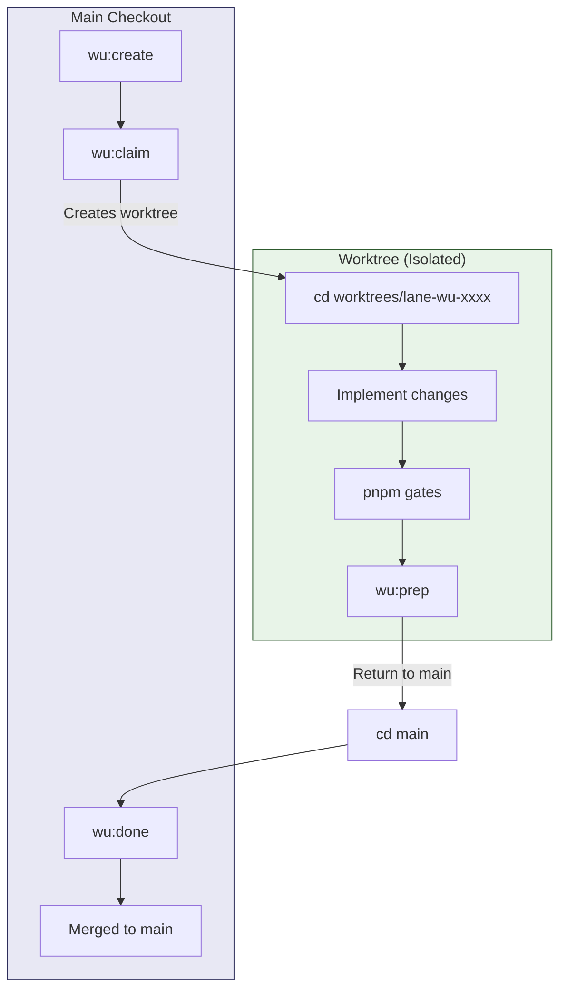
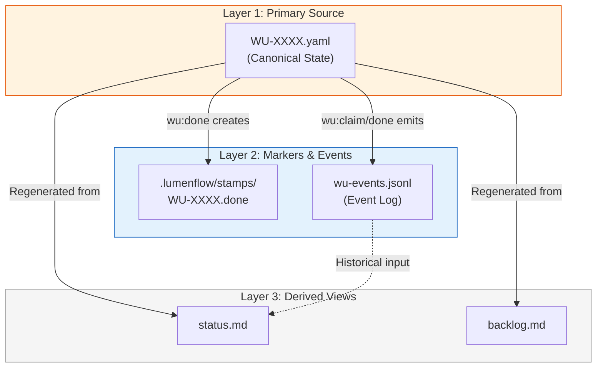
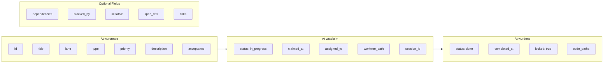
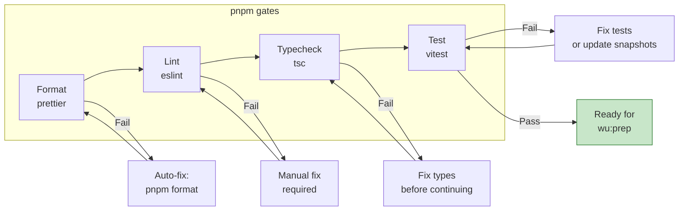
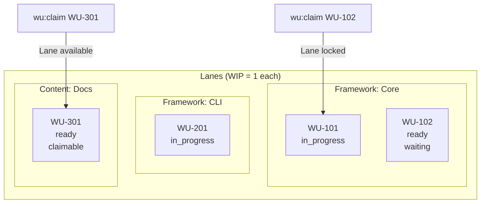
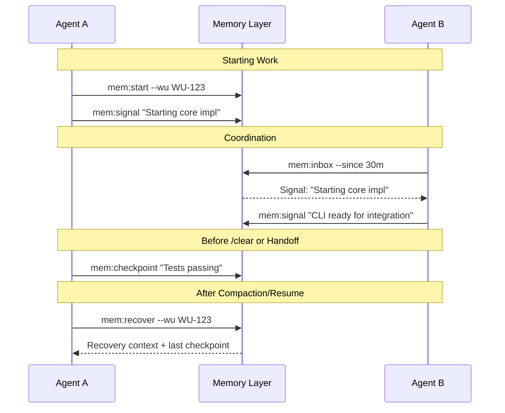
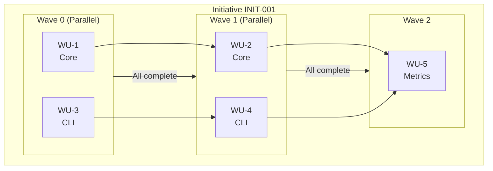

import { Aside } from '@astrojs/starlight/components';

This page provides visual mental models for the core LumenFlow concepts. Use these diagrams as quick references when working with the framework.

## WU Lifecycle

Work Units progress through 5 states with specific transitions.

```mermaid
stateDiagram-v2
    [*] --> ready: create

    ready --> in_progress: claim

    in_progress --> blocked: block (requires reason)
    in_progress --> waiting: wait
    in_progress --> done: complete
    in_progress --> ready: release (orphan recovery)

    blocked --> in_progress: unblock
    blocked --> done: complete

    waiting --> in_progress: resume
    waiting --> done: complete

    done --> [*]

    note right of done: Terminal state
    note right of ready: Aliases: todo, backlog
```

**Key points:**

- `done` is terminal (no outgoing transitions)
- `block` requires a reason
- `release` enables orphan recovery when agents are interrupted

---

## Worktree Discipline

All work happens in isolated worktrees to prevent the "absolute path trap".



**Key points:**

- Work happens ONLY in worktree after `wu:claim`
- `wu:prep` runs gates in the worktree
- `wu:done` runs from main (merges + cleanup)

---

## State File Relationships

LumenFlow uses a layered state model with YAML specs as the single source of truth.



**Key points:**

- YAML spec is the **single source of truth**
- Stamps are existence proofs (empty marker files)
- `status.md` and `backlog.md` are **always regenerable**
- Events provide audit trail, not authority

---

## WU Spec Anatomy

Fields are populated at different lifecycle stages.



**Key points:**

- Required fields must exist at creation (no placeholders allowed)
- Claim adds execution context (worktree, session)
- Done locks the WU and records completion

---

## Gates Pipeline

Quality gates run in sequence before completion.



**Key points:**

- Gates run in sequence: format → lint → typecheck → test
- Each gate must pass before the next runs
- Format failures can auto-fix; others require manual intervention
- All gates must pass before `wu:prep` / `wu:done`

---

## Lane WIP & Locking

Lanes prevent parallel work conflicts with WIP limits.



**Key points:**

- Each lane has WIP limit of 1 (configurable)
- `wu:claim` checks lane availability before claiming
- Lock policies: `all` (blocked holds lock) vs `active` (only in_progress)
- Prevents merge conflicts from parallel work in same area

---

## Memory & Agent Coordination

Agents communicate via signals, checkpoints, and recovery.



**Key points:**

- Signals enable agent-to-agent coordination
- Checkpoints preserve progress before `/clear`
- Recovery restores context after compaction
- All stored in `.lumenflow/memory/`

---

## Initiative Wave Orchestration

<Aside type="tip" title="Advanced">
  This section covers initiative orchestration, which is used for coordinating multiple WUs across
  lanes.
</Aside>

WUs are organized into parallel execution waves based on dependencies.



**Key points:**

- WUs in same wave run in parallel
- Max 1 WU per lane per wave (prevents contention)
- Waves execute sequentially
- Stamp files (`.lumenflow/stamps/WU-XXXX.done`) mark completion for dependency resolution

---

## Next Steps

- [Work Units](/concepts/work-units) - Deep dive into WU structure
- [Lanes](/concepts/lanes) - Lane configuration and policies
- [Gates](/concepts/gates) - Quality gate configuration
- [Memory Layer](/concepts/memory) - Memory and coordination details
