# LumenFlow Delivery Framework (Unified Operating Document)

**Version:** 1.1
**Effective Date:** 2025-02-26
**Replaces:** GOD.md (Generic Operating Document) + SOD.md (Stack Operating Document) + TDD-AI-HEX v1.0

---

## LumenFlow Documentation Structure

LumenFlow consists of three complementary documents:

1. **[./manifesto.md](./manifesto.md)** - **WHY**: Philosophy, commitments, and promises to stakeholders
2. **[./lumenflow-complete.md](./lumenflow-complete.md)** (this document) - **WHAT**: Complete framework, rules, standards, and governance
3. **[./playbook.md](./playbook.md)** - **HOW**: Daily operations, ceremonies, examples, and practical guidance

**Quick reference:** See [./workspace-modes.md](./workspace-modes.md) for a decision table on when to use worktrees, branch-only, docs-only, or fork modes.

**For new team members**: Start with the Manifesto, then read this document in full, then reference the Playbook for day-to-day work.

---

## 1. Purpose & Scope

This is the **single source of truth** for how we work across all projects.
It unifies:

- **GOD principles** (lane-based WIP governance, backlog-as-law, autonomy, DoD)
- **TDD-AI-HEX heritage** (ports-first, test-first, hexagonal architecture)
- **SOD tech stack** (Next.js, Supabase, TypeScript, approved libraries)
- **AI-TDD methodology** (ports-first, test-driven, hexagonal architecture)

> **Note:** This document was previously published as the TDD-AI-HEX Workflow.
> The methodology is now named **LumenFlow** to make it stack-agnostic and shareable.

All projects must comply with this document. Stack-specific details are included inline.

---

## 2. Core Principles

### 2.1 Workflow Principles

- **Backlog is Law** – Once a WU (Work Unit) is signed off, it's ready for autonomous execution
- **Scope Discipline** – Implement only what the WU spec requires. Do not add features, helpers, escape hatches, or "nice to haves" that aren't explicitly requested. If something seems beneficial, note it for future discussion but don't build it.
- **Lane-Based WIP** – Each delivery lane may run at most one `in_progress` WU; blocked WUs must move to `blocked` before another item starts in that lane
- **TDD First** – Tests define contracts; AI implements to satisfy tests
- **Ports First** – Define interfaces before implementation
- **Framework First** – Use approved libraries; avoid custom code unless justified
- **MCP Validated** – Use MCP tools (context7, github, web search) to validate SDK usage, APIs, and best practices
- **Atomic Commits** – Each WU is self-contained with passing tests
- **Gates Must Pass** – All tests, lints, types green before closure

### 2.2 Architectural Principles

- **Hexagonal Architecture** (Ports & Adapters)
  - Core: `@{PROJECT_NAME}/ports` (interfaces only)
  - Application: `@{PROJECT_NAME}/application` (business logic, use cases)
  - Infrastructure: `@{PROJECT_NAME}/infrastructure` (adapters: Supabase, OpenAI, etc.)
  - **Golden Rule**: `application` NEVER imports `infrastructure`
- **Dependency Injection** – Use cases receive dependencies as parameters
- **Single Responsibility** – Each use case does one thing well
- **SOLID, DRY, KISS, YAGNI** – Standard engineering principles apply

### 2.3 Testing Principles

- **Testing Pyramid**: unit > integration > e2e
- **Coverage Threshold**: ≥90% for `@{PROJECT_NAME}/application`
- **Coverage Provider**: Vitest coverage uses the v8 provider; packages running `pnpm test -- --coverage` must include `@vitest/coverage-v8` in devDependencies
- **Mock Everything**: Use Vitest mocks for all external dependencies
- **Test Behaviors**: Focus on what the system does, not how
- **Arrange-Act-Assert**: Clear test structure with descriptive names
- **100% New Code**: All new/changed code must have tests

### 2.4 Flow States & Lanes

**Quick reference:** See [./workspace-modes.md](./workspace-modes.md) for workspace mode decision table and allowed paths.

#### Work Item States

Every Work Unit (WU) lives in one of five canonical states:

- `ready` – Approved and waiting for a lane to free up.
- `in_progress` – Actively being implemented; exactly one per lane.
- `blocked` – Cannot proceed because of an external dependency, review, or unanswered question.
- `waiting` – Implementation finished; awaiting verification, gates, or stakeholder sign-off.
- `done` – Meets Definition of Done and all gates are green.

State transitions are explicit. When a WU stalls for longer than a working session, move it to `blocked`, document the blocker, and free that lane for the next WU.

**Figure 1: WU State Machine** – This diagram shows the canonical state transitions for Work Units. Every WU flows from `ready` → `in_progress` → `done`, with possible detours through `blocked` or `waiting` states.


### 2.5 Constraints Capsule (Global Rules)

The **Constraints Capsule** is a short list of 6 non‑negotiable rules that every agent must keep "in working memory" from first plan through `wu:done`:

1. **Worktree discipline & git safety** — Work only in worktrees, treat main as read-only, never run destructive git commands on main
2. **WUs are specs, not code** — Respect code_paths boundaries, no feature creep, no code blocks in WU files
3. **Docs‑only vs code WUs** — Documentation WUs use `--docs-only` gates, code WUs run full gates
4. **LLM‑first, zero‑fallback inference** — Use LLMs for semantic tasks, fall back to safe defaults (never regex/keywords)
5. **Gates and skip‑gates** — Complete via `pnpm wu:done`; skip-gates only for pre-existing failures with `--reason` and `--fix-wu`
6. **Safety & governance** — Respect PHI/privacy rules, approved sources, RLS policies; when uncertain, choose safer path

**See [`.lumenflow/constraints.md`](../../../../.lumenflow/constraints.md) for complete constraint descriptions, enforcement mechanisms, and usage guidance.**

#### Strict WU Validation (WU-1329)

WU validation commands run in **strict mode by default**. This ensures WU specs reference only files that actually exist.

**What strict mode validates:**

- `code_paths` files exist on disk
- `test_paths` (unit/e2e) files exist on disk
- Validation warnings are treated as blocking errors

**Affected commands:**

| Command             | Strict Behavior                            |
| ------------------- | ------------------------------------------ |
| `wu:create`         | Fails if code_paths/test_paths don't exist |
| `wu:edit`           | Fails if edited paths don't exist          |
| `wu:validate`       | Treats warnings as errors                  |
| `initiative:add-wu` | Validates WU spec before linking (WU-1330) |

**Bypassing strict mode:**

Use `--no-strict` to bypass path existence checks (not recommended). Usage is logged for audit:

```bash
pnpm wu:create --lane "Framework: Core" --title "Plan ahead" \
  --code-paths "src/future-file.ts" --no-strict
```

**Agent expectations:**

1. Always prefer strict mode (default)
2. Create files before referencing them in WU specs
3. Only use `--no-strict` when planning WUs before implementation
4. Fix path issues rather than bypassing validation

#### Delivery Lanes

Lanes keep focus while enabling parallelism. The default lane set is:

| Lane             | Scope                                                                                             |
| ---------------- | ------------------------------------------------------------------------------------------------- |
| **Experience**   | Front-end surfaces, design systems, UX copy, accessibility.                                       |
| **Core Systems** | Domain logic, APIs, infrastructure-as-code, database work.                                        |
| **Intelligence** | Prompt design, model evaluation, agent behaviours, data labeling.                                 |
| **Operations**   | Tooling, CI/CD, observability, security, compliance, incident response.                           |
| **Discovery**    | Research spikes, user interviews, external benchmarking, regulatory review.                       |
| **Customer**     | Support ops, success playbooks, onboarding, escalation workflows, user feedback loops.            |
| **Revenue Ops**  | Pricing, billing, finance automation, cohort analysis, retention tracking, payback metrics.       |
| **Comms**        | Brand, content, investor updates, incident comms, changelog, postmortems, transparency reporting. |

**Business lanes (Customer, Revenue Ops, Comms):**

- Focus on processes, content, policies, and metrics
- Still follow WIP=1 (one active WU per lane)
- Still require worktrees (same as all other lanes)
- Use `pnpm gates --docs-only` for documentation-only WUs (skips lint/typecheck/tests)
- YAML tooling uses the `yaml` package via core helpers; unquoted YYYY-MM-DD values remain strings (avoid js-yaml).

Teams may refine or split lanes (e.g., separate Mobile from Web) but must keep the one-WU-per-lane rule. Discovery WUs are time-boxed and typically produce briefs or decision records, after which implementation WUs begin in the relevant lane.

Lanes are published in the backlog header. New lanes require a short rationale in `./operating-manual.md` to keep the taxonomy transparent.

#### Lane Tooling (INIT-006)

LumenFlow provides CLI commands and configuration options for lane management:

**Lane Configuration in `.lumenflow.config.yaml`:**

```yaml
lanes:
  definitions:
    - name: 'Framework: Core'
      wip_limit: 1
      code_paths:
        - 'packages/@lumenflow/core/**'

    - name: 'Content: Documentation'
      wip_limit: 4
      wip_justification: 'Docs WUs are low-conflict parallel work targeting different pages'
      code_paths:
        - 'docs/**'
```

**WIP Justification (WU-1187):**

Philosophy: **If you need WIP > 1, you need better lanes, not higher limits.**

When `wip_limit` is greater than 1, the `wip_justification` field is required. This is soft enforcement - a warning is logged at `wu:claim` time if missing, but it doesn't block the claim.

**Lane Lock Policy (INIT-013):**

The `lock_policy` field controls how blocked WUs affect lane availability. By default, a blocked WU still occupies its lane (WIP=1 counts blocked work). With `lock_policy: active`, blocked WUs release the lane lock, allowing another WU to be claimed in that lane.

```yaml
lanes:
  definitions:
    - name: 'Content: Documentation'
      wip_limit: 4
      lock_policy: active # blocked WUs release lane lock
      code_paths:
        - 'docs/**'
```

| Policy   | Behavior                                                                 |
| -------- | ------------------------------------------------------------------------ |
| `all`    | Default. Blocked WUs count toward WIP. Lane stays occupied when blocked. |
| `active` | Only in_progress WUs count. Blocked WUs release the lane lock.           |
| `none`   | WIP checking disabled. Multiple WUs can be claimed regardless of status. |

**When to use each policy:**

- **`all` (default)**: High-conflict lanes where blocked work may resume soon. Prevents merge conflicts from overlapping claims.
- **`active`**: Low-conflict lanes like documentation where blocked work is unlikely to cause merge conflicts. Reduces idle time when work is blocked on dependencies.
- **`none`**: Experimental. Use only for lanes with guaranteed non-overlapping work (e.g., independent doc pages).

**CLI behavior with `lock_policy: active`:**

- `wu:claim`: Checks only in_progress WUs against WIP limit
- `wu:block`: Releases the lane lock, freeing the lane for new claims
- `wu:unblock`: Re-acquires the lane lock (may fail if lane is now occupied)
- `wu:brief`: Considers policy when generating handoff prompts
- `wu:delegate`: Uses same lane checks while recording delegation lineage

**Pilot recommendation (INIT-013):**

Start with `lock_policy: active` on the **Content: Documentation** lane:

1. Documentation WUs are low-conflict (different files, few dependencies)
2. Blocked docs WUs rarely resume immediately (often waiting for code WUs)
3. Easy rollback: change `active` back to `all` in config

**Rollback procedure:**

If `lock_policy: active` causes issues (merge conflicts, coordination problems):

1. Update `.lumenflow.config.yaml`: change `lock_policy: active` to `lock_policy: all`
2. Run `pnpm wu:unlock-lane --lane "<lane>"` to clear any stale locks
3. Any in_progress WUs will re-acquire locks on next commit

**Troubleshooting:**

| Issue                                    | Cause                                  | Fix                                                          |
| ---------------------------------------- | -------------------------------------- | ------------------------------------------------------------ |
| "Lane occupied" after unblock            | Another WU claimed while blocked       | Coordinate with other agent or wait for their WU to complete |
| Merge conflicts after claiming in active | Overlapping edits despite policy       | Split WU or change back to `policy: all`                     |
| Lock not released after block            | Using `policy: all` (default behavior) | Add `lock_policy: active` to lane config                     |
| Wave builder not seeing available lane   | Orchestrator using old policy cache    | Restart orchestrator or wait for cache refresh               |

**Lane Health Command (WU-1188):**

```bash
pnpm lane:health              # Run health check
pnpm lane:health --json       # Output as JSON
pnpm lane:health --verbose    # Show all checked files
```

Detects:

- **Overlapping code_paths** - Files matched by multiple lane definitions
- **Coverage gaps** - Code files not covered by any lane

**Lane Suggest Command (WU-1189, WU-1190):**

LLM-driven lane generation based on codebase context:

```bash
pnpm lane:suggest                       # Generate suggestions
pnpm lane:suggest --dry-run             # Preview without LLM call
pnpm lane:suggest --interactive         # Accept/skip/edit each
pnpm lane:suggest --include-git         # Add git history context
pnpm lane:suggest --output lanes.yaml   # Write to file
```

The `--include-git` flag extracts insights from git history:

- Co-occurrence (files frequently changed together)
- Ownership signals (primary contributors per area)
- Churn hotspots (files with high change frequency)

**Doctor and Gate Integration (WU-1191):**

Lane health is integrated into:

1. **`lumenflow doctor`** - Includes lane health in system health check
2. **`pnpm gates`** - Configurable via `gates.lane_health`:

```yaml
gates:
  lane_health: warn # 'warn' | 'error' | 'off'
```

| Value   | Behavior                              |
| ------- | ------------------------------------- |
| `warn`  | Log warning if issues found (default) |
| `error` | Fail gates if issues found            |
| `off`   | Skip lane health check during gates   |

**Parallel execution:** Every claimed WU runs inside its own Git worktree. `pnpm wu:claim` updates canonical state on `origin/main` using a push-only micro-worktree, creates the lane branch, and provisions `worktrees/<lane>-wu-xxx/` (override with flags if required). By default it pushes the lane branch to `origin` so other agents can see the claim. From that moment, the main checkout is read/review/admin only for that WU: browse code, run scripts, or apply a non-WU typo fix, but **ALL WU edits, staging, commits, and tests stay inside the worktree**. If a WU stalls beyond a working session, move it to `blocked` with `pnpm wu:block`; once the dependency clears, return it to `in_progress` with `pnpm wu:unblock`. On completion, `pnpm wu:done` runs gates, updates docs, stamps, pushes, and removes the worktree. See `./02-playbook.md` §4.4 for the full flow.

**Push retry on race conditions (WU-1332):** When multiple agents run micro-worktree operations concurrently (e.g., `wu:claim`, `wu:create`, `initiative:add`), pushes to `origin/main` may fail with non-fast-forward errors if another agent pushes first. LumenFlow automatically detects these failures and retries with exponential backoff: fetch latest, rebase, re-merge, and push again. Configure via `.lumenflow.config.yaml`:

```yaml
git:
  push_retry:
    enabled: true # Enable automatic retry (default)
    retries: 3 # Max attempts including initial (default: 3)
    min_delay_ms: 100 # Base delay for backoff (default: 100)
    max_delay_ms: 1000 # Max delay cap (default: 1000)
    jitter: true # Randomize delays (recommended for concurrent agents)
```

**Worktree discipline (IMMUTABLE law):**

- After `pnpm wu:claim`, immediately `cd worktrees/<lane>-wu-xxx/` and stay there until `pnpm wu:done`.
- Main checkout allowance: read/review, run scripts, or a surgical non-WU typo fix. The instant a change belongs to WU-XXX (code, docs, YAML, prompts, tooling), move it into the worktree.
- One worktree per active lane WU keeps installs, node_modules, caches, and git history isolated while respecting WIP=1.
- Hooks now fail any WU commit attempted from the main checkout and any lane branch pushed from the main directory.

**Dependency-closure bootstrap for worktrees (WU-1480):**

Fresh worktrees don't have built `dist/` directories. Dist-backed CLI commands (e.g., `lane:health`, `gates`) require `@lumenflow/cli` and its workspace dependencies to be built. Run `pnpm bootstrap` after claiming a worktree to build the CLI plus its full dependency closure (core, memory, metrics, initiatives, agent) in one command:

```bash
pnpm wu:claim --id WU-XXX --lane "Lane"
cd worktrees/<lane>-wu-xxx
pnpm bootstrap    # Builds @lumenflow/cli + dependency closure via turbo --filter
pnpm lane:health  # Now works
```

**Why this is not "too restrictive":**

1. **Worktrees are cheap** – `pnpm wu:claim` provisions them in seconds.
2. **Isolation is safety** – Your WU cannot break someone else’s, and theirs cannot bleed into yours.
3. **Parallel work scales** – Ten agents on ten WUs stay independent.
4. **Ownership stays clear** – Git log cleanly attributes each WU's branch and commits.
5. **Completion stays atomic** – `pnpm wu:done` merges, stamps, and cleans up in one go.

**Figure 3: Worktree Discipline Flow** – This diagram shows the complete lifecycle of working with worktrees in LumenFlow. All WU work happens inside isolated worktrees to maintain clean separation and enable parallel execution.


**Key Points:**

- **Immutable Law**: After `wu:claim`, immediately `cd` into the worktree and stay there
- **Main Checkout**: Read-only for WU work (browse, run scripts, but no WU edits)
- **Atomic Completion**: `wu:done` merges, stamps, and removes worktree in one operation
- **Hooks Enforce**: Pre-commit hooks fail if you attempt WU commits from main

**Worktree Golden Rules:**

When using worktrees, follow these absolute rules to maintain workflow discipline:

| Rule                                   | Description                                                                                                  |
| -------------------------------------- | ------------------------------------------------------------------------------------------------------------ |
| **MUST: cd into worktree**             | ALL work for a claimed WU happens inside the worktree (`cd worktrees/<lane>-wu-xxx`)                         |
| **NEVER: work in main after claiming** | Main checkout becomes read-only for that WU (no edits, no staging, no commits)                               |
| **MUST: use pnpm wu:done**             | Finish every WU with `pnpm wu:done`; it merges, stamps, and removes the worktree atomically                  |
| **NEVER: bypass hooks**                | Pre-commit/commit-msg fail if you attempt a WU commit from the main checkout                                 |
| **NEVER: touch other agents' work**    | If main has uncommitted changes you didn't create, ask the user first (don't stash/reset/commit/modify them) |

**Visual Examples:**

**❌ WRONG: Working in main directory after claiming WU**

```bash
# User claims WU (creates worktree)
pnpm wu:claim --id WU-427 --lane Operations

# ❌ WRONG: Stays in main directory and makes edits
vim tools/wu-done.mjs       # ERROR: Not isolated to lane
git add tools/
git commit -m "wu(WU-427): add validator"  # Bypasses worktree!
```

**✅ RIGHT: Working inside the worktree**

```bash
# User claims WU (creates worktree)
pnpm wu:claim --id WU-427 --lane Operations

# ✅ RIGHT: cd into worktree immediately
cd worktrees/operations-wu-427

# ALL work happens here
vim tools/wu-done.mjs
git add tools/
git commit -m "wu(WU-427): add validator"

# When done, return to main and complete
cd ../..
pnpm wu:done --id WU-427  # Merges, cleans up, stamps
```

**Why this matters:** Working in main after claiming a worktree:

1. Breaks lane isolation (changes not on lane branch)
2. Bypasses `pnpm wu:done` merge safety checks
3. Leaves worktree orphaned (requires manual cleanup)
4. Violates WIP=1 enforcement (lane shows occupied but work elsewhere)

#### Tool Usage in Worktrees (AI Agent Guidance)

**Context:** During WU-218, an AI agent accidentally bypassed worktree isolation using absolute file paths, ran destructive git commands on main, and attempted manual merges. These violations were not explicitly documented as antipatterns. This section codifies those learnings.

**The Absolute Path Trap:**

AI agents using Write/Edit/Read tools can inadvertently bypass worktree isolation by passing absolute paths. Even when the shell working directory is correct (`cd worktrees/lane-wu-xxx`), file operation tools that accept absolute paths will target the main checkout if given `/home/.../exampleapp.co.uk/apps/...` instead of relative `apps/...`.

**❌ WRONG: Using absolute paths (bypasses worktree isolation)**

```typescript
// Agent is in worktrees/operations-wu-427/ but uses absolute path
Write({
  file_path: '/home/tom/source/{ORG}/{PROJECT_REPO}/{PROJECT_ROOT}/web/src/lib/validator.ts', // Writes to MAIN, not worktree!
  content: '...',
});
```

**✅ RIGHT: Using relative paths (respects worktree context)**

```typescript
// Agent is in worktrees/operations-wu-427/ and uses relative path
Write({
  file_path: '{PROJECT_ROOT}/web/src/lib/validator.ts', // Writes to worktree correctly
  content: '...',
});
```

**Verification Pattern:**

Before any file operation, verify your working directory:

```bash
# Check current directory
pwd
# Should output: /home/tom/source/{ORG}/{PROJECT_REPO}/worktrees/operations-wu-427

# Then use relative paths for all file operations
```

**Dangerous Git Commands on Main:**

NEVER run destructive or manual git commands on the main checkout during WU work. These operations can destroy parallel work in other lanes or corrupt the worktree/main relationship.

**❌ WRONG: Destructive git commands on main**

```bash
# In main checkout
git reset --hard HEAD  # ❌ Destroys uncommitted changes, breaks parallel WUs
git merge lane/operations/wu-427  # ❌ Manual merge bypasses wu:done safety checks
git rebase -i main  # ❌ Rewrites history, breaks worktree tracking
touch .lumenflow/stamps/WU-427.done  # ❌ Manual stamp bypasses validation
```

**✅ RIGHT: Let wu:done handle everything**

```bash
# In worktree: do your work, commit, push
cd worktrees/operations-wu-427
git add .
git commit -m "wu(wu-427): add validator"
git push origin lane/operations/wu-427

# Return to main and let wu:done orchestrate merge + stamp + cleanup
cd ../..
pnpm wu:done --id WU-427
# ✅ Runs gates in worktree
# ✅ Fast-forward merges to main
# ✅ Creates stamp atomically
# ✅ Updates backlog/status
# ✅ Removes worktree
# ✅ Pushes to origin
```

**wu:done is the ONLY way to complete a WU:**

The `pnpm wu:done` command is atomic and handles:

1. **Gates validation** in the worktree (not main)
2. **Fast-forward-only merge** to main (prevents conflicts)
3. **Stamp creation** (`.lumenflow/stamps/WU-XXX.done`)
4. **Documentation updates** (backlog.md, status.md)
5. **Worktree removal** (cleanup)
6. **Push to origin** (publish)

Manual steps (creating stamps by hand, merging manually, editing docs in main) bypass these safety checks and can leave the repository in an inconsistent state.

**Incident Reference:**

These patterns were discovered during [WU-218](../tasks/wu/WU-218.yaml) when an AI agent:

- Used Write tool with absolute paths → created files in main instead of worktree
- Ran `git reset --hard` on main → could have destroyed parallel work
- Attempted manual merges → bypassed wu:done validation
- Created stamps manually → bypassed state transition validation

**Summary (AI Agent Checklist):**

- [ ] After `pnpm wu:claim`, immediately `cd worktrees/<lane>-wu-xxx`
- [ ] Verify working directory with `pwd` before file operations
- [ ] Use relative paths for ALL Write/Edit/Read operations
- [ ] NEVER run `git reset`, `git merge`, `git rebase` on main during WU work
- [ ] NEVER manually create `.lumenflow/stamps/*.done` files
- [ ] Use `pnpm wu:done --id WU-XXX` to complete (ONLY way to finish a WU)
- [ ] If blocked, use `pnpm wu:block` (not manual edits to backlog/status)

### 2.6 Canonical Lifecycle Map (WU-1635)

This section provides a single-page reference for how every `wu:*` command, memory tool, and orchestration tool fits into the WU lifecycle. It covers both **worktree mode** (default, local agents) and **cloud/branch-PR mode** (Codex, CI bots, GitHub App).

#### 2.6.1 Command-Mode Matrix

Each command runs from a specific **location** (main checkout, worktree, or lane branch) and produces a defined **handoff** to the next step. Using a command from the wrong location triggers a context-validation error with a copy-paste fix.

| Command | Worktree Mode | Cloud/Branch-PR Mode | Expected Location | Handoff |
| --- | --- | --- | --- | --- |
| `wu:create` | Creates WU YAML on main via micro-worktree push | Same (or `--cloud` writes on active branch) | Main checkout (or any branch with `--cloud`) | WU spec ready for `wu:claim` |
| `wu:claim` | Updates canonical state on `origin/main`, creates worktree at `worktrees/<lane>-wu-xxx` | `--cloud` sets `claimed_mode: branch-pr`, no worktree created | Main checkout | `cd worktrees/<lane>-wu-xxx` (worktree) or stay on branch (cloud) |
| `wu:brief` | Generates handoff prompt with memory context for another agent | Same | Main checkout or worktree | Copy prompt to new agent session |
| `wu:delegate` | Generates prompt and records delegation lineage | Same | Main checkout or worktree | Delegation record + prompt |
| `wu:prep` | Runs gates in worktree, prints `wu:done` copy-paste instruction | Validates branch, runs gates in-place | Worktree (worktree mode) or main checkout (branch-pr) | Copy-paste `wu:done` command |
| `wu:done` | Fast-forward merge to main, stamp, cleanup, push | Creates PR (does NOT merge), stamp deferred to `wu:cleanup` | Main checkout | WU complete (worktree) or PR created (cloud) |
| `wu:cleanup` | N/A (wu:done handles everything) | Post-PR-merge: stamp, YAML update, branch delete | Main checkout (after PR merge) | WU fully complete |
| `wu:block` | Sets status to `blocked`, frees lane | Same | Worktree or main | Lane freed for new claim |
| `wu:unblock` | Sets status to `in_progress`, re-acquires lane | Same | Worktree or main | Resume work |
| `wu:recover` | Analyzes and fixes state inconsistencies | Applies branch-pr fixes on claimed branch | Main checkout or worktree | State reconciled |
| `wu:release` | Releases orphaned WU (`in_progress` to `ready`) | Same | Main checkout | WU available for reclaim |
| `wu:status` | Shows status, location, valid commands | Same | Any | Informational only |

**Memory and orchestration tools** (run from worktree or main):

| Command | Purpose | Typical Location |
| --- | --- | --- |
| `mem:checkpoint` | Save progress for context recovery | Worktree |
| `mem:recover` | Generate recovery context after compaction | Main or worktree |
| `mem:signal` | Broadcast coordination signal to other agents | Worktree |
| `mem:inbox` | Read coordination signals from other agents | Main or worktree |
| `mem:start` | Start session, surfaces unread signals | Worktree |
| `orchestrate:initiative` | Orchestrate initiative wave execution | Main |
| `orchestrate:init-status` | Compact initiative progress view | Main |
| `orchestrate:monitor` | Monitor delegation/agent activity | Main |
| `state:doctor` | Diagnose and auto-fix state store issues | Main |

#### 2.6.2 Lifecycle Flow (Worktree Mode)

```
wu:create ──> wu:claim ──> cd worktree ──> [implement] ──> wu:prep ──> wu:done
                                 |                            |            |
                                 |  mem:checkpoint (periodic)  |            |
                                 |  mem:signal (coordination)  |            |
                                 |                            |            |
                                 |  wu:block (if stalled) ────+            |
                                 |  wu:unblock (when ready) ──+            |
                                 |                                         |
                                 +--- gates run here (worktree) ──> merge to main
                                                                    stamp created
                                                                    worktree removed
                                                                    push to origin
```

#### 2.6.3 Lifecycle Flow (Cloud/Branch-PR Mode)

```
wu:create --cloud ──> wu:claim --cloud ──> [work on lane branch] ──> wu:prep ──> wu:done
                                                    |                               |
                                                    |                         PR created
                                                    |                               |
                                                    |                      [review + merge]
                                                    |                               |
                                                    +───────────────> wu:cleanup ────+
                                                                        stamp created
                                                                        YAML updated
                                                                        branch deleted
```

#### 2.6.4 Cross-References

- **Failure-mode runbook**: See [Appendix A](#appendix-a-failure-mode-runbook-wu-1635) in this document
- **Troubleshooting wu:done**: See [troubleshooting-wu-done.md](./agent/onboarding/troubleshooting-wu-done.md)
- **First WU mistakes**: See [first-wu-mistakes.md](./agent/onboarding/first-wu-mistakes.md)
- **Quick command reference**: See [quick-ref-commands.md](./agent/onboarding/quick-ref-commands.md)
- **WU sizing guide**: See [wu-sizing-guide.md](./wu-sizing-guide.md)
- **Workspace modes**: See [workspace-modes.md](./workspace-modes.md) (if it exists) or section 2.4 above

---

## 3. Tech Stack

### 3.1 Frontend

- **Web**: Next.js 16 (App Router, React 19, TypeScript, Tailwind v4, shadcn/ui, Radix UI)
- **Mobile**: Expo (React Native, Expo Router)

### 3.2 Backend & Infrastructure

- **Runtime**: Node.js 20+, Edge Functions
- **Database**: Supabase (Postgres + RLS)
- **Auth**: Supabase Auth
- **AI**: OpenAI SDK (GPT-4 Turbo)
- **Realtime**: Supabase Realtime
- **Payments**: Stripe SDK

### 3.3 Development & Testing

- **Language**: TypeScript (strict mode)

---

## 5. Memory Enforcement (INIT-015)

LumenFlow's memory layer supports configurable enforcement of checkpointing, signal integrity, and decay-based archival. All enforcement features are opt-in, fail-open by default, and configured under `memory.enforcement` and `memory.decay` in `.lumenflow.config.yaml`.

### 5.1 Auto-Checkpoint Enforcement (WU-1471)

When enabled, auto-checkpoint hooks create checkpoints automatically during agent work without requiring manual `mem:checkpoint` calls.

```yaml
memory:
  enforcement:
    auto_checkpoint:
      enabled: true # Generate PostToolUse + SubagentStop hooks
      interval_tool_calls: 30 # Checkpoint every N tool calls (default: 30)
    require_checkpoint_for_done: warn # 'off' | 'warn' | 'block'
```

**Hook behavior:**

- **PostToolUse**: Fires after every tool call. A per-WU counter increments and triggers a checkpoint when `interval_tool_calls` is reached. Checkpoint writes are backgrounded in a defensive subshell to avoid blocking the agent.
- **SubagentStop**: Fires when a sub-agent finishes. Always creates a checkpoint (no counter required).

**wu:done checkpoint gate:**

| `require_checkpoint_for_done` | Behavior                                         |
| ----------------------------- | ------------------------------------------------ |
| `off`                         | No checkpoint check during wu:done               |
| `warn` (default)              | Warn if no checkpoints exist for the WU          |
| `block`                       | Block wu:done if no checkpoints exist for the WU |

On completion, wu:done cleans up hook counter files at `.lumenflow/state/hook-counters/<WU_ID>.json`.

**Prerequisites:** Auto-checkpoint hooks require the `agents.clients.claude-code.enforcement.hooks` master switch to be `true`. When the auto-checkpoint policy is enabled but the hooks master switch is disabled, tooling emits a warning and remains advisory-only.

Generate hooks after configuration:

```bash
pnpm lumenflow:integrate --client claude-code
```

### 5.2 Signal Receipts (WU-1472)

Signal read-marking uses append-only receipts instead of rewriting `signals.jsonl`. This prevents concurrent agents from overwriting each other's read-state updates.

**How it works:**

- `mem:inbox` marks signals as read by appending receipt entries (not modifying the original signal)
- `loadSignals` merges effective read state from both inline `read: true` (legacy) and appended receipts
- Signal cleanup (`signal:cleanup`) is receipt-aware and removes orphaned receipts for cleaned-up signals
- Use `--no-mark` with `mem:inbox` to read signals without generating receipts

**Backward compatibility:** Existing inline `read: true` flags are honored. New read-marking always uses receipts.

### 5.3 Orchestrator Recovery (WU-1473)

CLI lifecycle commands surface unread signals and consume them at appropriate touchpoints:

- **wu:claim / mem:start**: Surfaces unread signal summary so agents can consume pending coordination messages at session start
- **wu:done**: Marks completed-WU signals as read using receipt-aware behavior and prints the count
- **PreCompact / SessionStart hooks**: Support non-worktree orchestrator context (e.g., inbox check) without breaking existing worktree behavior

All CLI integrations remain fail-open and do not block primary WU lifecycle commands on memory errors.

### 5.3.1 Agent Launch Tracking (WU-1612)

When agents spawn sub-agents via the Task tool, the orchestrating agent loses all awareness of those sub-agents after context compaction. The agent launch tracking hook closes this gap by recording each launch in the signal bus.

**Three-hook recovery pipeline:**

```
PostToolUse(Task)           PreCompact              SessionStart
─────────────────           ──────────              ────────────
Agent spawns Task     →     Compaction triggers  →  Agent wakes up
Hook records signal:        Recovery file includes  Hook surfaces:
  agent ID                  recent signals from     "3 agents were running,
  subagent type             mem:inbox               here are their IDs"
  description                                       Agent resumes via
  output file (if bg)                               Task(resume=agentId)
```

**Hook details** (`.claude/hooks/track-agent-launch.sh`):

- **Trigger**: PostToolUse on `Task` tool calls
- **Input**: Parses `tool_response.agent_id`, `tool_input.description`, `tool_input.subagent_type`, and `tool_input.run_in_background` from the hook JSON
- **Output**: Writes a `mem:signal` scoped to the active WU (e.g., `agent-launch: agent-abc (Explore): Find API endpoints [background: /path/to/output]`)
- **WU detection**: Extracts WU ID from git branch name (`lane/*/wu-NNNN`) — no pnpm dependency, fast
- **Fail-open**: Always exits 0. No-ops when not in a WU context, when `.lumenflow/` is missing, or when the agent ID cannot be parsed
- **Timeout**: Synchronous `mem:signal` call with 5-second timeout to ensure delivery without blocking

**Configuration** (`.claude/settings.json`):

```json
{
  "hooks": {
    "PostToolUse": [
      {
        "matcher": "Task",
        "hooks": [
          {
            "type": "command",
            "command": "$CLAUDE_PROJECT_DIR/.claude/hooks/track-agent-launch.sh"
          }
        ]
      }
    ]
  }
}
```

**Limitations:**

- Only tracks agents launched while on a WU branch (no WU = no signal target)
- Does not auto-resume agents — surfaces IDs so the resumed agent can decide
- Signal delivery depends on `mem:signal` CLI being available (fails silently otherwise)

### 5.4 Decay Policy (WU-1474)

Decay-based archival removes stale memory nodes during lifecycle events, preventing unbounded memory accumulation.

```yaml
memory:
  decay:
    enabled: true # Enable decay-based archival (default: false)
    threshold: 0.1 # Score below which nodes are archived (0-1, default: 0.1)
    half_life_days: 30 # How quickly nodes lose relevance (default: 30)
    trigger: on_done # 'on_done' | 'manual' (default: on_done)
```

| Field            | Type    | Default   | Description                                   |
| ---------------- | ------- | --------- | --------------------------------------------- |
| `enabled`        | boolean | `false`   | Enable automated decay archival               |
| `threshold`      | number  | `0.1`     | Score below which nodes are archived (0 to 1) |
| `half_life_days` | integer | `30`      | Days until node relevance halves              |
| `trigger`        | enum    | `on_done` | When to run: `on_done` or `manual`            |

**Trigger modes:**

- **`on_done`**: wu:done invokes decay archival after gates pass. Errors never block completion (fail-open).
- **`manual`**: Decay only runs via `pnpm mem:cleanup`. Useful for teams that prefer explicit control.

When decay is disabled, existing wu:done behavior is unchanged. Manual cleanup (`pnpm mem:cleanup`) remains available regardless of the decay configuration and supports `--dry-run` preview.

---

## 6. Definition of Done & Validation

### 6.4 Validation (Definition of Done)

- Gates must pass (`pnpm gates`).
- Use `pnpm wu:done` to run gates in the lane worktree and perform a fast‑forward merge.
- Stamps and documentation updates are atomic with the done commit.

#### 6.4.1 Run Gates on the Change (Not Main)

Always run gates in the lane worktree that contains your change. Use `pnpm wu:done --id WU-XXX`. This runs gates in the worktree, then performs a fast‑forward merge. Do not run gates on `main` as a proxy for validating your branch.

#### 6.4.2 Main is Read-Only

The shared `main` checkout is read-only for all WU work. Hooks block direct commits on `main` to prevent accidental manual merges. All WUs (including documentation-only WUs) must use worktrees via `pnpm wu:claim`. The only exceptions are surgical non-WU fixes (e.g., typo fixes unrelated to any WU).

#### 6.4.3 Troubleshooting `wu:done`

- If validation errors claim missing `code_paths` or `notes`, ensure those edits were committed in the worktree branch—`wu:done` validates using the worktree's WU YAML.
- If the worktree is missing, recreate it or use `--skip-gates` with `--reason` and `--fix-wu` (audited). Skipping gates should only be used when failures are pre‑existing and tracked.

#### 6.4.3.1 Spec Quality Requirements (WU-1162)

**NEW:** `wu:done` validates spec completeness before running gates to prevent placeholder WUs from being marked done.

**Required for all WUs:**

- ✅ **No placeholder text:** Description and acceptance criteria cannot contain `[PLACEHOLDER]` markers
- ✅ **Minimum description length:** Description must be ≥50 characters with Context/Problem/Solution
- ✅ **Code paths documented:** Non-documentation WUs must list all modified files in `code_paths`
- ✅ **Acceptance criteria specific:** Replace generic placeholders with specific tests/evidence

**Validation enforced by:**

- `tools/validate.mjs` - CI check for done WUs (blocks merge if placeholders found)
- `tools/wu-done.mjs` - Pre-gates validation (fails immediately if spec incomplete)
- `packages/@lumenflow/core/src/wu-done-*.ts` - Modular wu:done validators and preflight helpers

**Error example:**

```
❌ Spec completeness validation failed for WU-1234:
  - Description contains [PLACEHOLDER] marker
  - Acceptance criteria contain [PLACEHOLDER] markers
  - Description too short (12 chars, minimum 50)

Fix these issues before running wu:done:
  1. Update docs/04-operations/tasks/wu/WU-1234.yaml
  2. Fill description with Context/Problem/Solution
  3. Replace [PLACEHOLDER] text with specific criteria
  4. List all modified files in code_paths
  5. Re-run: pnpm wu:done --id WU-1234

See: CLAUDE.md §2.7 "WUs are specs, not code"
```

**Why this matters:**

- Prevents "ghost completions" (WUs marked done with no implementation)
- Enforces "Backlog is Law" principle (specs must be complete and actionable)
- Provides audit trail of what was actually implemented
- Allows any agent to understand what was done without archeology

#### 6.4.3.2 Writing Acceptance Criteria (Outcomes First)

Write acceptance criteria so another agent can verify completion by observing behaviour and evidence, without needing the same implementation approach.

**Default rule:** Prefer outcomes/behaviour over implementation details.

**Good acceptance criteria are:**

- **Observable**: verifiable via tests, logs/metrics, UI behaviour, or a manual smoke check documented in `notes`.
- **Specific**: includes the scenario and what success looks like.
- **Resilient**: avoids naming a particular module/file/architecture unless that constraint is essential.

**When implementation-level criteria are appropriate (use sparingly):**

- **Security/compliance** requirements (RLS policies, PHI logging rules, auth boundaries)
- **Database/infrastructure** contracts (tables, functions, indexes, migrations, CI gates)
- **Governance** constraints (e.g., prompts loaded via YAML/registry; never bypass hooks)

**Examples:**

- ✅ Outcome: “Clearly off-scope request → Acknowledge → Boundary → Bridge; does not comply with the off-scope request.”
- ✅ Evidence: “Unit test asserts deflection behaviour for representative off-scope inputs; in-scope requests unaffected.”
- ✅ Constraint (only if needed): “Avoid brittle keyword/category taxonomies in scope enforcement logic.”

#### 6.4.4 API Endpoint Testing Requirements

HTTP endpoints, database adapters, and other infrastructure boundaries require both **unit tests** (fast, isolated) and **integration tests** (realistic, end-to-end contract validation). This section establishes when each test type is required and how to structure them.

**When Integration Tests Are Mandatory:**

Integration tests are **required** (not optional) for:

- **HTTP endpoints** (REST APIs, GraphQL resolvers, server routes)
- **Database adapters** (repository implementations, query builders)
- **External service clients** (payment processors, email services, LLM providers)
- **File system operations** (document uploads, export generation)
- **Authentication/authorization boundaries** (session validation, permission checks)

**Why:** Unit tests with mocked dependencies can hide real-world behavior (null vs undefined, HTTP 400 vs 404, database constraint violations). Integration tests catch these issues by exercising actual infrastructure contracts.

**Coverage Thresholds:**

- **Unit tests:** ≥90% coverage for application logic (use cases, domain models, validators)
- **Integration tests:** ≥80% coverage for infrastructure adapters (database, HTTP, external APIs)
- **Changed tests:** All new/modified tests run in CI, regardless of `test_paths` (prevents stale test references)

**Mocking Philosophy:**

**✅ DO mock:**

- Infrastructure (databases, HTTP clients, file systems)
- External services (payment gateways, LLM APIs, email senders)
- Time-dependent functions (clocks, timers)

**❌ DO NOT mock:**

- Language/framework primitives (URL parsers, JSON validators, HTTP request objects)
- Standard library functions (string manipulation, date parsing, collections)
- Your own domain logic (business rules, validation functions)

**Why:** Mocking primitives hides real runtime behavior. Integration tests should exercise actual language/framework behavior to catch bugs like:

**Case Study (WU-648):** Unit tests mocked URL parameter parsing and returned `undefined` for missing optional params. Production code used native URL parser which returns `null`. Integration test with real HTTP request object would have caught the `null` vs `undefined` mismatch before production.

**Manual Smoke Checks:**

For changes that can't be fully tested via automated tests (UI/UX, performance, browser compatibility), document manual verification in WU YAML `notes`:

```yaml
notes: |
  Manual smoke check (2025-10-26):
  $ curl -X POST http://localhost:3000/api/endpoint -d '{"param": "value"}'
  ✓ Returns 200 OK with expected JSON schema
  ✓ Missing optional param returns 200 (not 400)
  ✓ Invalid param returns 400 with error details
```

**WU YAML Structure Requirements:**

Acceptance criteria must specify **test types** explicitly:

```yaml
acceptance:
  - 'Feature X works as specified'
  - 'Unit tests cover use case with ≥90% coverage (mocked dependencies)'
  - 'Integration test verifies endpoint with real HTTP requests (not mocked)'
  - 'Manual smoke check: [command] (results documented in notes)'

test_paths:
  unit:
    - 'packages/@{PROJECT_NAME}/application/src/__tests__/feature.test.ts'
  integration:
    - 'packages/@{PROJECT_NAME}/infrastructure/src/__tests__/adapter.integration.test.ts'
```

**Skip-Gates Governance:**

If pre-existing test failures block `wu:done` completion, see §6.4.3 for `--skip-gates` usage and requirements. Never skip gates for failures introduced by your WU.

**Cross-Layer Testing Strategy:**

See §9.5 (Hexagonal Architecture Testing Strategy) for how to structure tests across domain, application, adapter, and infrastructure layers.

- **Build**: Turborepo + pnpm workspaces
- **Testing**: Vitest (unit/integration), Playwright (E2E), React Testing Library
- **Linting**: ESLint (flat config, strict)
- **Formatting**: Prettier (enforced in CI)
- **CI/CD**: GitHub Actions → Vercel + Expo EAS

### 3.4 Approved Libraries

| Domain        | Library                | Rationale                               |
| ------------- | ---------------------- | --------------------------------------- |
| UI Components | shadcn/ui, Radix UI    | Accessible, composable, well-maintained |
| Forms         | React Hook Form + Zod  | Type-safe, performant                   |
| State         | TanStack Query         | Server state management, caching        |
| Styling       | Tailwind CSS v4        | Utility-first, fast                     |
| Testing       | Vitest, Playwright     | Fast, ESM-native, reliable              |
| Observability | Sentry + OpenTelemetry | Error tracking + tracing                |

**Deviation Policy**: New libs require VDR (Vendor Decision Record) + ADR (Architecture Decision Record).

---

## 4. Hexagonal Architecture Structure

### 4.1 Package Layout

```
packages/
├── @{PROJECT_NAME}/ports/          # 🔵 Interfaces/Contracts (NO implementation)
├── @{PROJECT_NAME}/application/    # 🟢 Business Logic (Use Cases)
├── @{PROJECT_NAME}/infrastructure/ # 🟠 Adapters (Supabase, OpenAI, etc.)
├── @repo/supabase/        # Shared Supabase client config
├── @repo/ui/              # Shared UI components
├── @repo/config-*/        # Shared configs (eslint, typescript, prettier)
└── linters/               # Custom linters
```

### 4.2 Dependency Flow

```
apps/web, apps/mobile
         ↓ depends on
@{PROJECT_NAME}/application (pure business logic)
         ↓ depends on
@{PROJECT_NAME}/ports (interfaces only)
         ↑ implements
@{PROJECT_NAME}/infrastructure (Supabase, OpenAI, etc.)
```

**Enforcement**: Use ESLint `import/no-restricted-paths` to block `application` → `infrastructure` imports.

### 4.3 Port Examples

```typescript
// @{PROJECT_NAME}/ports/src/ports.ts
export interface AuthService {
  signIn(email: string): Promise<ServiceResponse<{ userId?: string }>>;
  signUp(email: string, password: string): Promise<ServiceResponse<{ userId: string }>>;
  signOut(): Promise<ServiceResponse<void>>;
  getCurrentUser(): Promise<ServiceResponse<User | null>>;
}

export interface WidgetRepository {
  create(widget: Omit<Widget, 'id' | 'createdAt' | 'updatedAt'>): Promise<ServiceResponse<Widget>>;
  findById(id: string): Promise<ServiceResponse<Widget | null>>;
  findByUser(userId: string): Promise<ServiceResponse<Widget[]>>;
  update(id: string, updates: Partial<Widget>): Promise<ServiceResponse<Widget>>;
  delete(id: string): Promise<ServiceResponse<void>>;
}

export interface ObservabilityService {
  startSpan(name: string, attributes?: Record<string, string | number | boolean>): Span;
  recordError(error: Error, context?: Record<string, unknown>): void;
  log(
    level: 'debug' | 'info' | 'warn' | 'error',
    message: string,
    context?: Record<string, unknown>,
  ): void;
}
```

---

## 5. AI-TDD 5-Step Workflow (Per WU)

**Figure 2: AI-TDD 5-Step Workflow** – This diagram illustrates the hexagonal architecture workflow for implementing each Work Unit. Follow this sequence to maintain clean separation between ports, application logic, and infrastructure adapters.

```mermaid
flowchart TD
    Start([Start WU]) --> Step1[Step 1: Define Ports<br/>Human-led]
    Step1 --> Step2[Step 2: Write Tests First<br/>Human-led, with mocks]
    Step2 --> Step3[Step 3: Implement Use Case<br/>AI-led with human oversight]
    Step3 --> Step4[Step 4: Run Tests<br/>RED → GREEN]
    Step4 --> Decision{Tests Pass?}
    Decision -->|No| Fix[Debug & Fix]
    Fix --> Step3
    Decision -->|Yes| Step5[Step 5: Create Adapter<br/>Infrastructure layer]
    Step5 --> Gates[Run Gates<br/>format, lint, typecheck]
    Gates --> GatesPass{Gates Pass?}
    GatesPass -->|No| FixGates[Fix Issues]
    FixGates --> Gates
    GatesPass -->|Yes| Done([wu:done])

    style Step1 fill:#e1f5ff
    style Step2 fill:#fff4e1
    style Step3 fill:#e8f5e9
    style Step4 fill:#fff4e1
    style Step5 fill:#f3e5f5
    style Done fill:#c8e6c9

    classDef humanLed stroke:#2196F3,stroke-width:3px
    classDef aiLed stroke:#4CAF50,stroke-width:3px
    class Step1,Step2 humanLed
    class Step3,Step5 aiLed
```



**Key Principles:**

- **Ports First**: Define interfaces before implementation (Step 1)
- **Tests First**: Write failing tests using mocked dependencies (Step 2)
- **Application Logic**: Implement use case in `@exampleapp/application` (Step 3)
- **TDD Cycle**: Run tests until green (Step 4)
- **Adapters Last**: Wire up infrastructure adapters (Step 5)
- **Hexagonal Boundaries**: No `application → infrastructure` imports

### Step 1: Define Ports (Human-led)

```typescript
// packages/@{PROJECT_NAME}/ports/src/ports.ts
export interface ExampleService {
  doSomething(input: Input): Promise<ServiceResponse<Result>>;
}
```

### Step 2: Write Tests First (Human-led)

```typescript
// packages/@{PROJECT_NAME}/application/src/__tests__/example.test.ts
import { describe, it, expect, beforeEach, vi } from 'vitest';
import { exampleUseCase } from '../usecases/example.js';
import type { ExampleService, ObservabilityService } from '@{PROJECT_NAME}/ports';

describe('exampleUseCase', () => {
  let mockService: ExampleService;
  let mockObservability: ObservabilityService;

  beforeEach(() => {
    mockService = { doSomething: vi.fn() };
    mockObservability = { startSpan: vi.fn(), recordError: vi.fn(), log: vi.fn() };
  });

  it('should successfully complete operation', async () => {
    // Arrange
    const mockResult = { success: true, data: { value: 'test' } };
    vi.mocked(mockService.doSomething).mockResolvedValue(mockResult);

    // Act
    const result = await exampleUseCase(
      { service: mockService, observability: mockObservability },
      { input: 'test' },
    );

    // Assert
    expect(result.success).toBe(true);
    expect(mockService.doSomething).toHaveBeenCalledWith({ input: 'test' });
  });

  it('should handle validation errors', async () => {
    // Test edge cases, validation, errors
  });
});
```

### Step 3: Implement Use Case (AI-led, human oversight)

```typescript
// packages/@{PROJECT_NAME}/application/src/usecases/example.ts
import type { ExampleService, ObservabilityService, ServiceResponse } from '@{PROJECT_NAME}/ports';

export async function exampleUseCase(
  deps: { service: ExampleService; observability: ObservabilityService },
  input: { input: string },
): Promise<ServiceResponse<Result>> {
  const span = deps.observability.startSpan('usecase.example');

  try {
    // Validation
    if (!input.input) {
      return { success: false, error: 'Input required', code: 'MISSING_INPUT' };
    }

    // Business logic
    const result = await deps.service.doSomething(input);

    span.end();
    return result;
  } catch (error) {
    deps.observability.recordError(error as Error);
    span.end();
    return { success: false, error: 'Operation failed', code: 'OPERATION_ERROR' };
  }
}
```

### Step 4: Run Tests & Validate

```bash
# Run use case tests
pnpm --filter @{PROJECT_NAME}/application test

# Run all gates
pnpm gates
```

### Step 5: Create Infrastructure Adapter

```typescript
// packages/@{PROJECT_NAME}/infrastructure/src/example/SupabaseExampleService.ts
import type { SupabaseClient } from '@supabase/supabase-js';
import type { ExampleService, ServiceResponse } from '@{PROJECT_NAME}/ports';

export class SupabaseExampleService implements ExampleService {
  constructor(private supabase: SupabaseClient) {}

  async doSomething(input: Input): Promise<ServiceResponse<Result>> {
    try {
      const { data, error } = await this.supabase.from('examples').insert(input).select().single();

      if (error) {
        return { success: false, error: error.message };
      }

      return { success: true, data };
    } catch (error) {
      return {
        success: false,
        error: error instanceof Error ? error.message : 'Unknown error',
      };
    }
  }
}
```

---

## 6. WU Lifecycle

### 6.1 WU Structure (backlog.yml)

```yaml
- id: WU-XXX
  title: 'Implement LLM-powered mode detection'
  status: ready # ready | in_progress | done
  locked: false # true when complete and stamped
  acceptance:
    - 'User can trigger mode detection from chat message'
    - 'Mode detection makes OpenAI structured output API call with prompt template classification/mode-detection.yaml'
    - 'Integration test verifies actual OpenAI API response parsing (not mocked)'
    - 'Fallback regex detector remains for error resilience'
    - 'Test coverage ≥90%'
    - 'No TODO/FIXME comments in production code'
  code_paths:
    - 'packages/@{PROJECT_NAME}/application/src/usecases/mode-detection.ts'
    - 'packages/@{PROJECT_NAME}/infrastructure/src/openai/ModeDetectionAdapter.ts'
  test_paths:
    - 'packages/@{PROJECT_NAME}/application/src/__tests__/mode-detection.test.ts'
    - 'packages/@{PROJECT_NAME}/infrastructure/src/__tests__/integration/mode-detection.integration.test.ts'
  ports:
    - 'ModeDetectionService'
    - 'ObservabilityService'
  artifacts:
    - '.lumenflow/stamps/WU-XXX.done'
    - 'prompts/classification/mode-detection.yaml'
  # WU-1998: Exposure field (declares user-facing nature)
  exposure: 'api' # ui | api | backend-only | documentation
  # Optional: user_journey (recommended for ui/api exposure)
  user_journey: 'User sends chat message, mode detection returns classification'
  # Optional: ui_pairing_wus (recommended for api exposure)
  ui_pairing_wus:
    - 'WU-YYY' # UI WU that consumes this API
  # Optional: spec_refs (links to plan documents)
  spec_refs:
    - 'lumenflow://plans/WU-XXX-plan.md'
```

#### 6.1.1 Exposure Field (WU-1998)

The `exposure` field declares how a WU exposes functionality to users, ensuring backend features have corresponding UI coverage.

**Valid values:**

| Value           | Description                                    | Recommended fields                |
| --------------- | ---------------------------------------------- | --------------------------------- |
| `ui`            | User-facing UI changes (pages, components)     | `user_journey`, `navigation_path` |
| `api`           | API endpoints called by UI or external clients | `user_journey`, `ui_pairing_wus`  |
| `backend-only`  | Backend-only changes (no user visibility)      | None                              |
| `documentation` | Documentation changes only                     | None                              |

**Optional related fields:**

- `user_journey`: Describes the end-user interaction flow. Recommended for `ui` and `api` exposure.
- `ui_pairing_wus`: Array of WU IDs for UI work that consumes this API. Recommended for `api` exposure.
- `navigation_path`: Route where UI feature is accessible (e.g., `/settings`). Required for `ui` exposure if code_paths doesn't include a page file.

**Transition period:** The field is optional during the transition period. WUs without `exposure` will receive a validation warning but will not fail.

#### 6.1.2 Feature Accessibility Validation (WU-2022)

When `exposure: ui` is set, `wu:done` validates that the feature is actually accessible to users. This prevents "orphaned code" where features exist but users cannot navigate to them.

**Accessibility is verified by ANY of:**

1. `navigation_path` field is specified (e.g., `/dashboard`)
2. `code_paths` includes a page file (e.g., `apps/web/src/app/dashboard/page.tsx`)
3. `tests.manual` includes navigation/accessibility verification (e.g., "Navigate to /space and verify feature is accessible")

If none of these are present, `wu:done` will **block** completion with an actionable error message.

**Skip flag:** Use `--skip-accessibility-check` to bypass (not recommended).

### 6.2 Discovery

1. Read `{PROJECT_ROOT}/tasks/status.md`, `{PROJECT_ROOT}/tasks/backlog.md`, and the relevant WU YAMLs
2. **Run existing tests first** → `pnpm gates` (let test failures guide diagnosis)
3. Select one WU that fits an available lane (one active WU per lane)
4. Define `code_paths`, `test_paths`, acceptance criteria
5. **Diagnostic Workflow** (if investigating issue):
   - Run full test suite
   - Analyze specific failures
   - Write reproduction tests
   - Identify root cause
   - Create targeted WU

### 6.3 Implementation

1. **Define Ports** (Step 1): Create interfaces in `@{PROJECT_NAME}/ports`
2. **Write Tests** (Step 2): Define expected behavior with mocks
3. **Implement Use Case** (Step 3): Write code to satisfy tests
4. **Run Tests** (Step 4): `pnpm --filter @{PROJECT_NAME}/application test`
5. **Create Adapter** (Step 5): Implement infrastructure layer
6. Apply best practices (security, accessibility, performance)
7. Update documentation alongside code

### 6.4 Validation (Definition of Done)

A WU is **done** when:

1. ✅ At least one passing test (unit or E2E)
2. ✅ Test coverage ≥90% for new code
3. ✅ All gates green (`pnpm gates`)
4. ✅ Ports defined (if new domain)
5. ✅ Use case + adapter implemented
6. ✅ **Documentation updated** (backlog, context, progress, relevant specs/manuals)
7. ✅ Updated WU YAML with `status: done`, `locked: true`, and `completed: YYYY-MM-DD`
8. ✅ `.done` stamp in `.lumenflow/stamps/WU-XXX.done`
9. ✅ **Code Quality Requirements**:
   - No TODO/FIXME/HACK/XXX comments in production code paths (tests excepted)
   - No classes/functions/methods named Mock, Stub, Fake, Placeholder in production code (test utilities excepted)
   - No commented-out code blocks (use git history instead)
10. ✅ **Implementation Completeness**:
    - Acceptance criteria specify actual implementation, not just interface
    - Example: "Makes OpenAI API calls with prompt template X" NOT "Uses LLM-powered detection"
    - For LLM integration WUs: At least one integration test calling actual LLM service (not mocked)
11. ✅ **Intelligence lane only**: Prompt evaluation passing (`pnpm prompts:eval`) with pass rate ≥90%

**IMPORTANT**: Documentation must be updated BEFORE marking a WU as done and creating the stamp. This ensures work is properly tracked and the knowledge base stays current.

**Intelligence Lane DoD (Prompt Work)**:

When a WU involves prompt changes (new prompts, prompt modifications, or prompt versions):

1. Run prompt evaluation harness: `pnpm prompts:eval`
2. Ensure pass rate ≥90% on golden examples
3. Verify all guardrails passing (PII detection, toxicity, refusal, shock protocol)
4. If pass rate drops >3pp vs baseline: justify in prompt version notes.md
5. Update baseline metrics in `.lumenflow/artifacts/prompts/baselines/<version>.json`

This requirement ensures the Intelligence lane has the same rigor as Experience/Core lanes.

**Rationale for Code Quality Requirements** (added 2025-10-15):

These rules prevent incomplete implementations from being marked done. See [llm-migration-audit-2025-10-15.md](../product/beacon/archive/llm-migration-audit-2025-10-15.md) for context.

- **TODO comments**: Signal incomplete work; should block WU completion
- **Mock classes in production**: Interface ≠ implementation; mocks belong in test files only
- **Vague acceptance criteria**: "Uses LLM" can be satisfied by interface alone; require specific evidence

**Run Gates**:

```bash
pnpm gates
# Runs: format:check → lint → typecheck → spec:linter → tests
```

#### Config-Driven Gates (WU-1067)

Gates can be configured via `.lumenflow.config.yaml` for any language/toolchain:

```yaml
# .lumenflow.config.yaml
gates:
  execution:
    format: 'pnpm format:check'
    lint: 'pnpm lint'
    typecheck: 'pnpm typecheck'
    test: 'pnpm test'
```

Use presets for common languages:

```yaml
gates:
  execution:
    preset: 'python' # node, python, go, rust, dotnet
    lint: 'ruff check . && mypy .' # Override specific commands
```

When no `gates.execution` config is present, the CLI falls back to auto-detection and hardcoded defaults (backwards compatible).

**IMPORTANT**: When using `pnpm wu:done`, gates are run in the lane worktree context (the code being merged), NOT on main. This ensures "gates must pass" validates the actual change and keeps trunk always releasable per LumenFlow canon. The sequence is:

1. Run gates in lane worktree
2. Fast-forward-only merge to main
3. Push to main

**Skip-Gates Emergency Escape Hatch** (`--skip-gates`):

In rare cases where pre-existing test failures block completion of genuinely finished work, you may use:

**Important:** `--skip-gates` skips the gates run inside `wu:done`. Git hooks still run and must pass; **do not use `--no-verify`**.

**Why this works:** `wu:done` creates non-code commits (WU YAML/status/stamps); your code must already be committed on the lane branch in the worktree.

```bash
pnpm wu:done --id WU-XXX --skip-gates --reason "Pre-existing failures from infrastructure issue" --fix-wu WU-YYY
```

**Requirements**:

- `--reason`: Explain why gates are being skipped (mandatory)
- `--fix-wu WU-XXX`: Specify the WU that will fix the failures (mandatory)

**Only use when ALL of these are true**:

1. Test failures existed before your WU (confirm with git log / main branch)
2. Your WU work is genuinely complete and ready to merge
3. A separate WU exists (or you're creating one) to fix the failures
4. Failures are infrastructure or unrelated code issues

**NEVER use --skip-gates for**:

- Failures introduced by your WU
- Failures you haven't investigated
- Skipping gates "just to finish quickly"

All skip-gates events are logged to `.lumenflow/skip-gates-audit.log` with timestamp, user, reason, and fix-WU for accountability.

This prevents merging broken code and maintains the integrity of the main branch.

#### Docs-Only WUs

Documentation-only WUs (type: `documentation`) streamline completion for changes that only modify documentation files without touching application code.

**Characteristics:**

- `type: documentation` in WU YAML
- Modifies only: `docs/**`, `docs/**`, `*.md` files, `.lumenflow/stamps/**`
- Does NOT modify: `apps/**`, `packages/**`, `supabase/**`, `tools/**` (except test files)

**Gates behavior:**

- Uses `--docs-only` flag: `pnpm gates -- --docs-only`
- Runs: `validate.mjs`, `spec-linter` (validation & documentation linting)
- Skips: lint, typecheck, application tests (not applicable to docs)

**Path validation:**

- `tools/lib/docs-path-validator.mjs` enforces allowed paths
- Staging code files in a docs WU causes validation failure
- Prevents scope creep (docs WU sneaking in code changes)

**Definition of Done (docs WUs):**

1. ✅ Documentation format valid (Prettier, spec-linter)
2. ✅ WU YAML updated (`status: done`, `locked: true`, `completed: YYYY-MM-DD`)
3. ✅ `.done` stamp in `.lumenflow/stamps/WU-XXX.done`
4. ✅ Only docs paths modified (enforced by path validator)
5. ❌ Code coverage NOT required (no code changes)
6. ❌ Application tests NOT required (docs-only gates skip them)

**Examples of docs-only WUs:**

- Fix typo in ./lumenflow-complete.md
- Add new section to playbook
- Update ADR (Architecture Decision Record)
- Clarify acceptance criteria in backlog WU

**NOT docs-only:**

- Add comment to source code (code change, needs tests)
- Update API docs AND code (code WU, not docs-only)
- Modify tooling scripts in `tools/**` (tooling WU, not docs)

**Workflow:**

```bash
# 1. Claim WU (type: documentation in YAML)
pnpm wu:claim --id WU-420 --lane Operations

# 2. Make documentation changes
vim ./lumenflow-complete.md

# 3. Commit in worktree
git add memory-bank/
git commit -m "wu(wu-420): improve lumenflow docs"
git push origin lane/operations/wu-420

# 4. Complete (runs docs-only gates automatically)
cd ../..
pnpm wu:done --id WU-420
# → Detects type: documentation
# → Runs: pnpm gates -- --docs-only (skips lint/typecheck/tests)
# → Validates paths (fails if code files staged)
# → Merges, stamps, pushes
```

**Rationale:**
LumenFlow canon (§6.6) requires documentation updates BEFORE marking WU done. However, docs-only changes (typo fixes, playbook updates) shouldn't require app tests to pass. This path:

- Maintains documentation quality (format, linting)
- Enforces path restrictions (no code sneaking in)
- Skips irrelevant gates (code tests, typecheck)
- Speeds up docs WU completion

**Path validation strictness:**
Forces proper categorization of work. If a WU needs to update both docs AND code, it's a code WU (with docs updates as part of DoD), not a docs-only WU.

**CI integration (future):**
GitHub Actions should use path filters to skip app builds/tests for commits that only touch docs paths. This WU implements the tooling; CI configuration is separate work.

### 6.5 MCP Validation

**Model Context Protocol (MCP)** tools should be used to validate implementation decisions:

- **When to use MCP**:
  - Verifying SDK usage and current best practices
  - Checking API documentation for external services (OpenAI, Supabase, Stripe)
  - Validating library usage patterns (shadcn/ui, React Hook Form, TanStack Query)
  - Confirming TypeScript patterns and type definitions
  - Looking up current framework conventions (Next.js App Router, Expo)

- **Available MCP Tools**:
  - `context7` – Up-to-date library documentation (prefer for SDK/framework validation)
  - `github` – Repository access, issue tracking, PR management
  - `memory` – Persistent context and knowledge graph
  - Web search – General technical validation and troubleshooting

- **Best Practices**:
  - Validate external API usage before implementation
  - Check for breaking changes in dependencies
  - Verify security best practices for sensitive operations
  - Capture sources and decisions in the relevant WU YAML (`notes` section) when making architecture decisions
  - Never embed secrets or PII in MCP queries

**Example**: Before implementing Supabase RLS policies, use `context7` to verify current Supabase RLS patterns and best practices.

### 6.6 Documentation (Required Before Commit)

**Documentation updates are MANDATORY before marking a WU as done.**

For every completed WU, update these files in order:

1. **WU YAML** (`{PROJECT_ROOT}/tasks/wu/WU-XXX.yaml`):
   - Set `status: done` (in the WU YAML)
   - Set `locked: true` (in the WU YAML)
   - Add `completed: YYYY-MM-DD`
   - Fill `code_paths`, `test_paths`, `artifacts`
   - Document resolution in `notes` field

2. **Status Board** (`{PROJECT_ROOT}/tasks/status.md`):
   - Move the WU between **In Progress** / **Blocked** / remove once done
   - Ensure only one WU remains under **In Progress**

3. **Backlog** (`{PROJECT_ROOT}/tasks/backlog.md`):
   - Move WU from "In progress" to "Done" with completion date
   - Verify the lane shows 0 active WUs after the move

4. **Change Manifest** (`ops/ci/change-manifest.yml`):
   - Update with WU reference and modified paths

5. **If applicable** (based on WU scope):
   - Spec files (`docs/spec/`)
   - ADRs (Architecture Decision Records)
   - Playbooks or operational manuals
   - API documentation

**Order of operations for WU completion:**

**Using worktrees (recommended):**

```bash
# 1. All work happens INSIDE the worktree
cd worktrees/operations-wu-427

# 2. All tests pass
pnpm gates

# 3. Commit all work (docs + code + tests)
git add .
git commit -m "wu(WU-427): description"
git push origin lane/operations/wu-427

# 4. Return to main directory
cd ../..

# 5. Use helper to complete (merges, updates docs, creates stamp, removes worktree)
pnpm wu:done --id WU-427
```

**Direct on main (solo, simple changes only):**

```bash
# 1. All tests pass
pnpm gates

# 2. Update documentation (6 steps above)
# ... edit files ...

# 3. Create done stamp
mkdir -p .lumenflow/stamps
touch .lumenflow/stamps/WU-XXX.done

# 4. Commit (includes docs + stamp)
git add memory-bank/ ops/ci/ .lumenflow/stamps/ [code files]
git commit -m "wu(WU-XXX): description"

# 5. Push
git push origin main
```

**Why this matters:** Documentation drift creates confusion, lost context, and duplicate work. Keeping docs current ensures the team (human and AI) has accurate context for future work.

**Critical reminder:** If you used `pnpm wu:claim` to create a worktree, you MUST work inside that worktree and use `pnpm wu:done` to complete. NEVER manually merge or edit in the main directory after claiming.

### 6.7 Commit & Push

```bash
# Stage only WU-relevant files
git add [files]

# Commit format
git commit -m "wu(WU-XXX): concise description"

# Push directly to main (trunk-based)
git push origin main
```

### 6.8 Plans

Plans are markdown documents that capture goals, scope, approach, and success criteria before implementation begins. They provide high-level context for WUs and initiatives.

#### Plan Storage

Plans are stored in the repository at `docs/04-operations/plans/` (configurable via `directories.plansDir` in `.lumenflow.config.yaml`).

#### Linking Plans to Initiatives

Use `initiative:plan` to link a plan to an initiative:

```bash
# Create a new plan template and link it
pnpm initiative:plan --initiative INIT-001 --create

# Link an existing plan file
pnpm initiative:plan --initiative INIT-001 --plan docs/04-operations/plans/my-plan.md
```

This sets the `related_plan` field in the initiative YAML:

```yaml
# In INIT-001.yaml
related_plan: lumenflow://plans/INIT-001-user-authentication.md
```

#### Linking Plans to WUs

WUs link to plans via the `spec_refs` field:

```bash
# When creating a WU
pnpm wu:create --id WU-123 --lane "Framework: Core" --title "Feature" \
  --spec-refs "lumenflow://plans/WU-123-plan.md"
```

Or in the WU YAML:

```yaml
spec_refs:
  - 'lumenflow://plans/WU-123-plan.md'
```

#### Plan URI Format

Plans use the `lumenflow://plans/` URI scheme:

- `lumenflow://plans/INIT-001-auth-system.md` - Initiative plan
- `lumenflow://plans/WU-123-plan.md` - WU-specific plan

#### Plan Template

```markdown
# [INIT-XXX | WU-XXX] Plan - Title

## Goal

Primary objective

## Scope

In scope and out of scope

## Approach

Key phases, milestones, technical decisions

## Success Criteria

Measurable outcomes

## Risks

What could go wrong and mitigation

## References

- Initiative/WU: [ID]
- Created: [date]
```

#### When to Create Plans

- **Initiatives**: Always create a plan before breaking down into WUs
- **Feature WUs**: Create a plan for complex features (type: feature requires spec_refs)
- **Bug/Refactor WUs**: Plans optional, use notes field instead

---

## 7. Autonomy & Execution Rules

### 7.1 Zero-Wait Execution

- Agent/developer acts autonomously once backlog is signed off
- No pausing for reviews/approvals on ordinary execution

### 7.2 Stop-and-Ask (Narrow Scope)

Only stop and ask for:

- Policy changes
- Auth/permissions modifications
- PII/safety issues
- Cloud spend, secrets, backups
- Same error repeats 3x

### 7.3 Anti-Loop Guard

- Max **3 attempts** per unique error
- Max **25 tool calls** per WU
- If exceeded → escalate per §12

### 7.4 Stack-Specific Autonomy

- Must use **shadcn/ui** components where possible
- Must use **Supabase** for data (avoid additional DBs)
- Must use **Stripe SDK** for payments (no custom logic)
- Must use **OpenAI SDK** for LLM (via `@{PROJECT_NAME}/infrastructure`)

---

## 8. Bug-Handling Mid-WU

When a bug is discovered during WU execution, classify it quickly and follow the appropriate path based on priority and scope.

### 8.1 Priority Classification

| Priority  | Threshold                                                   | Response                                         |
| --------- | ----------------------------------------------------------- | ------------------------------------------------ |
| **P0**    | Production outage, data loss, auth breakage                 | Emergency WU: bypass queue, preempt lane         |
| **P1**    | User-visible defect or blocks current WU beyond one session | Raise Bug WU, block current WU, free lane        |
| **P2/P3** | Non-blocking, minor issue                                   | Log it, raise Bug WU in ready, finish current WU |

**Guardrail:** If the same error repeats 3× or touches auth/PII/secrets/spend, stop and escalate per §7.2 and §10.3.

**Figure 4: Bug Handling Decision Tree** – Follow this flowchart to determine whether to fix a bug in-place (within your current WU) or create a separate Bug WU. The decision depends on priority, scope, and size of the fix.


**Key Decision Points:**

- **P0 (Emergency)**: Immediate action, bypass all queues
- **P1 (High)**: Check fix-in-place criteria (ALL 4 must be true)
- **Fix-in-Place Criteria**: Blocks WU + same code_paths + ≤10 lines + test coverage fits
- **P2/P3 (Low)**: Log and defer, don't block current work

### 8.2 Decision Rule: Fix-in-Place vs New Bug WU

**Fix in the current WU** (no new Bug WU) **ONLY IF ALL** of the following are true:

1. **Blocks acceptance criteria**: The bug prevents your WU from meeting its acceptance criteria (cannot complete without fixing it)
2. **Same code paths**: The bug is in code already listed in your WU's `code_paths` (not new files)
3. **Small change**: The fix is **≤10 lines of changed code** (strict, measurable threshold)
4. **Test coverage fits**: The fix can be covered by existing or minimally adjusted tests in your WU's `test_paths`

**Process:**

- Add/adjust a failing test that reproduces the bug
- Fix the code to make the test pass
- Update the WU YAML acceptance criteria if the bug fix adds new acceptance criteria
- Proceed through gates → done as normal

**Otherwise: Raise a Bug WU**

- Scope creep is not allowed per §2.1 "Scope Discipline"
- Create a separate Bug WU with a failing reproduction test
- Link the two WUs (use `discovered_in` field)
- If the bug blocks your current lane, move your WU to `blocked` and free the lane

**Examples:**

| Scenario                                                                           | Fix-in-Place? | Rationale                            |
| ---------------------------------------------------------------------------------- | ------------- | ------------------------------------ |
| WU-500: Add feature X. Discover 1-line typo in function you're calling (same file) | ✅ Yes        | Small, same `code_paths`, blocks WU  |
| WU-500: Add feature X. Discover broken validation in unrelated module              | ❌ No         | Different code path → Bug WU         |
| WU-500: Add feature X. Discover performance issue requiring refactor (>10 lines)   | ❌ No         | Exceeds line threshold → Bug WU      |
| WU-500: Add feature X. Tests reveal edge case in your new code (3 lines)           | ✅ Yes        | Direct defect in WU scope, small fix |
| WU-500: Add UI component. Discover related component has accessibility issue       | ❌ No         | Not in WU's `code_paths` → Bug WU    |

### 8.3 Bug WU Template

Create `{PROJECT_ROOT}/tasks/wu/WU-####.yaml`:

```yaml
id: WU-####
title: 'BUG: <concise description>'
type: bug
lane: <appropriate lane>
status: ready
priority: P0|P1|P2|P3
discovered_in: WU-<current> # Link back to discovering WU
acceptance:
  - 'Reproduction case passes'
  - 'Regression tests added'
  - 'Root cause documented in notes'
  - 'No new accessibility/security violations'
ports:
  - '<relevant port(s)>'
test_paths:
  - 'packages/@{PROJECT_NAME}/application/src/__tests__/<area>/bug-####.test.ts'
code_paths:
  - '<files to change>'
artifacts:
  - '.lumenflow/stamps/WU-####.done'
notes:
  - 'Repro steps:'
  - 'Root cause hypothesis:'
  - 'Fix approach:'
links:
  - 'blocks: WU-<current>' # If this bug blocks the discovering WU
```

**Required steps:**

1. Add a failing test that reproduces the defect (unit/integration/e2e as appropriate)
2. If P0, immediately claim it in the appropriate lane (Emergency WU path, see §8.5)
3. Update `backlog.md` and `status.md` to reflect the new Bug WU

### 8.4 Update Boards & Flow States

**If you raised a blocking Bug WU (P1):**

- Move current WU → `blocked` (include reason + link to Bug WU)
- Free the lane (use `pnpm wu:block --id WU-<current> --reason "Blocked by WU-####"`)
- Move Bug WU to `in_progress` and claim it

**If non-blocking (P2/P3):**

- Keep current WU `in_progress`
- Bug WU stays `ready` for later triage
- Finish current WU first

Use the helpers (`wu:claim`, `wu:block`, `wu:unblock`, `wu:done`) to keep `status.md` and `backlog.md` in sync.

### 8.5 P0 Emergency WU Path & Lane Preemption

**Emergency WUs (P0) may preempt any lane:**

1. If the P0 Bug WU needs a lane that's currently `in_progress`, the displaced WU is auto-blocked with reason `Preempted by WU-####`
2. Use `pnpm wu:block` to record the preemption and free the lane
3. Immediately claim the P0 Bug WU via `pnpm wu:claim`
4. Follow TDD: write failing test → fix → all gates green → update docs → stamp → atomic commit
5. Commit with `fix(EMERGENCY): <description>` convention
6. Once P0 is done, use `pnpm wu:unblock` to restore the preempted WU

**Post-incident follow-up (see §10.4):**

- Create follow-up WUs for root cause analysis, regression tests, and observability improvements
- Capture metrics (Change Failure Rate, MTTR) via gates telemetry (see WU-402)

### 8.6 TDD Then Gates (Always)

Regardless of path (fix-in-place or Bug WU):

1. Write failing test(s) that reproduce the bug
2. Fix the code to make tests pass
3. All gates green: `pnpm gates` (format/lint/typecheck/spec-linter/tests)
4. Update documentation (WU YAML, status.md, backlog.md)
5. Create stamp, commit atomically

### 8.7 Decision Tree

```
Bug discovered → Classify (P0/P1/P2/P3)

→ P0 (Emergency: production outage/data loss/auth breakage)
   → Raise Bug WU
   → Preempt current WU if same lane (auto-block with reason "Preempted by WU-####")
   → Claim Bug WU immediately
   → Fix via TDD → gates → done

→ P1 (Blocking current WU or user-visible)
   → Raise Bug WU
   → Block current WU with reason + link
   → Free lane
   → Claim Bug WU

→ P2/P3 (Non-blocking/minor)
   → Is it within current WU scope & small TDD fix?
      → YES: Add failing test, fix in place, update WU YAML
      → NO: Raise Bug WU in ready, finish current WU first

→ Guardrail trigger (3× repetition or auth/PII/secrets/spend)?
   → Stop and escalate per §7.2 and §10.3
```

### 8.8 Why This Fits LumenFlow

- **Respects WIP=1 per lane** and explicit `blocked`/`waiting`/`done` states (§2.4)
- **Keeps backlog as source of truth** – no hidden work (§2.1)
- **Preserves small batches & trunk** with test-first safety (§2.1, §2.3)
- **Aligns with Scope Discipline** – fix-in-place only when it's truly within current WU scope (§2.1)
- **Integrates with Incident & Escalation** flow (§10)

**Helper command (future):** `pnpm wu:new:bug` can scaffold the YAML, a failing test file, and link it to the current WU. See [tools/lib/wu-helpers.mjs](../../tools/lib/wu-helpers.mjs) for implementation guidance.

---

## 9. Testing Strategy

### 9.1 Test Types

- **Unit Tests** – Core logic, mocked dependencies, ≥90% coverage
- **Integration Tests** – Service & API interactions, mocked external APIs
- **E2E Tests** – Critical paths & compliance (Playwright)
- **Accessibility Tests** – WCAG 2.1 AA compliance
- **Performance Tests** – Core Web Vitals & resource use

### 9.2 Test Organization

```
packages/@{PROJECT_NAME}/application/
├── src/
│   ├── usecases/
│   │   └── auth/
│   │       └── signIn.ts
│   └── __tests__/
│       └── auth/
│           └── signIn.test.ts
```

### 9.3 Test Patterns

```typescript
describe('Use Case Name', () => {
  let mockDep1: Dependency1;
  let mockDep2: Dependency2;

  beforeEach(() => {
    // Create fresh mocks
    mockDep1 = { method: vi.fn() };
    mockDep2 = { method: vi.fn() };
  });

  describe('Happy Path', () => {
    it('should succeed with valid input', async () => {
      // Arrange-Act-Assert
    });
  });

  describe('Error Cases', () => {
    it('should handle invalid input', async () => {
      // Test error handling
    });
  });

  describe('Edge Cases', () => {
    it('should handle boundary conditions', async () => {
      // Test edge cases
    });
  });
});
```

### 9.4 CI/CD Gates

- Lint, typecheck, tests must pass before merge/deploy
- Husky hooks enforce local gates (`tools/gates-local.mjs`)
- GitHub Actions enforce on push to `main`

### 9.5 Hexagonal Architecture Testing Strategy

Hexagonal architecture (Ports & Adapters) requires layer-appropriate testing. This section maps each architectural layer to its testing strategy, ensuring fast unit tests for business logic and targeted integration tests for infrastructure.

**Architecture Recap (see §4 for full structure):**

```
┌─────────────────────────────────────────┐
│   Adapters (HTTP, CLI, UI)             │  ← Integration tests (real HTTP/events)
├─────────────────────────────────────────┤
│   Application (Use Cases)              │  ← Unit tests (mocked ports)
├─────────────────────────────────────────┤
│   Domain (Business Logic, Entities)    │  ← Pure unit tests (no mocks)
├─────────────────────────────────────────┤
│   Ports (Interfaces)                   │  ← No tests (contracts only)
├─────────────────────────────────────────┤
│   Infrastructure (DB, APIs, External)  │  ← Integration tests (real dependencies)
└─────────────────────────────────────────┘
```

**Layer-Specific Testing Strategies:**

**1. Domain Layer (Pure Business Logic)**

- **Test type:** Pure unit tests (no mocks, no dependencies)
- **What to test:** Business rules, validation logic, domain calculations
- **Coverage target:** ≥95% (domain logic is mission-critical)
- **Example:** Testing a `calculateDiscount(price, customerTier)` function with various inputs

**Why:** Domain logic should have zero external dependencies, making it trivial to test exhaustively.

**2. Application Layer (Use Cases)**

- **Test type:** Unit tests with mocked ports
- **What to test:** Orchestration logic, error handling, use case workflows
- **Coverage target:** ≥90%
- **Mocking strategy:** Mock all ports (repositories, external services, observability)

**Example:** Testing a `createOrder(userId, items)` use case:

```pseudocode
describe('createOrder use case', () => {
  test('creates order and sends confirmation email', async () => {
    // Arrange: Mock ports
    const mockOrderRepository = { save: jest.fn() }
    const mockEmailService = { sendConfirmation: jest.fn() }

    // Act: Call use case
    await createOrder(
      { orderRepo: mockOrderRepository, email: mockEmailService },
      { userId: '123', items: [...] }
    )

    // Assert: Verify orchestration
    expect(mockOrderRepository.save).toHaveBeenCalledWith(...)
    expect(mockEmailService.sendConfirmation).toHaveBeenCalled()
  })
})
```

**Why:** Use cases orchestrate ports but don't implement infrastructure. Mocking ports isolates orchestration logic from infrastructure complexity.

**3. Adapter Layer (HTTP/CLI/UI Entry Points)**

- **Test type:** Unit tests (mocked infrastructure) + Integration tests (real HTTP/events)
- **What to test:**
  - Unit: Request parsing, validation, response formatting
  - Integration: End-to-end request → response flow with real HTTP server
- **Coverage target:** ≥80% integration, ≥90% unit

**Example (HTTP Adapter):**

- **Unit test:** Parse HTTP request body, validate schema, call use case with correct params
- **Integration test:** Start server, send real HTTP POST, verify response status + body structure

**Why:** Adapters translate external protocols (HTTP, CLI args) into domain calls. Unit tests verify translation logic; integration tests verify protocol contracts.

**4. Infrastructure Layer (Databases, External APIs)**

- **Test type:** Integration tests with real dependencies (or test doubles like in-memory DB)
- **What to test:** Query correctness, error handling, connection management
- **Coverage target:** ≥80%

**Example (Database Repository):**

```pseudocode
describe('OrderRepository integration tests', () => {
  beforeEach(async () => {
    // Set up test database (in-memory or Docker container)
    await setupTestDatabase()
  })

  test('saves order and retrieves by ID', async () => {
    const repo = new OrderRepository(testDbConnection)

    const order = await repo.save({ userId: '123', total: 99.99 })
    const retrieved = await repo.findById(order.id)

    expect(retrieved.userId).toBe('123')
    expect(retrieved.total).toBe(99.99)
  })
})
```

**Why:** Infrastructure code interacts with external systems (databases, APIs). Integration tests verify real behavior (SQL query correctness, API contract compliance).

**Golden Rules:**

1. **Test at the appropriate layer:** Don't integration-test domain logic (slow, brittle). Don't unit-test infrastructure without also having integration tests (misses real behavior).

2. **Mock ports, not primitives:** Mock your ports (interfaces), not language/framework primitives (URL parsers, HTTP request objects). See §6.4.4 for mocking philosophy.

3. **Fast feedback loop:** Domain + Application unit tests should run in <5 seconds for the entire suite (parallelizable, no I/O).

4. **Integration tests catch contract bugs:** Use integration tests to verify infrastructure contracts (database schemas, API response formats, HTTP status codes).

**Anti-Patterns:**

- ❌ Integration testing domain logic (bypasses fast unit tests)
- ❌ Unit testing infrastructure without integration tests (misses real SQL/API behavior)
- ❌ Mocking too much in integration tests (defeats the purpose)
- ❌ Skipping adapter integration tests (misses HTTP 400 vs 404, null vs undefined bugs)

**Cross-Reference:**

- See §4 for Hexagonal Architecture structure
- See §6.4.4 for API endpoint testing requirements
- See §5 for AI-TDD 5-step workflow (ports-first, tests-first)

---

## 10. Security & Compliance

### 10.1 Data Protection

- **RLS (Row-Level Security)** enforced on all patient data
- **PII minimization** in logs and observability
- **Redaction** before sending to LLMs
- **Secret scanning** enforced (no hardcoded secrets)

### 10.2 Authentication & Authorization

- Supabase Auth with secure cookies + JWT rotation
- Least privilege access
- Auth changes require explicit approval (Stop-and-Ask)

### 10.3 Accessibility & Inclusivity

- **WCAG 2.1 AA** compliance mandatory
- Keyboard + screen reader support
- Locale-aware time parsing (i18n ready)

### 10.4 Observability

- Structured logs, traces, metrics baked in
- No `console.log` in production code
- Error budgets + SLOs respected

### 10.5 Supply-Chain Security (WU-403)

ExampleApp requires rigorous supply-chain security for healthcare compliance (DTAC, ISO 27001, SOC 2).

**SBOM (Software Bill of Materials):**

- Generated automatically in CI using [Syft](https://github.com/anchore/syft)
- Format: SPDX JSON (industry standard)
- Archived as CI artifact for every build
- Provides audit trail of all dependencies and transitive dependencies

**Vulnerability Scanning:**

- Automated scanning with [Grype](https://github.com/anchore/grype)
- Fails CI build on HIGH or CRITICAL vulnerabilities
- Uses SBOM as input for accurate, efficient scanning
- Scans against multiple vulnerability databases (NVD, GitHub Security Advisories, etc.)

**Allowlist Policy (`.grype-allowlist.yaml`):**

Any HIGH/CRITICAL vulnerability exception requires:

1. **Impact analysis**: Detailed assessment of impact on ExampleApp
2. **Mitigation OR upgrade plan**: Document workaround or timeline to resolve
3. **Time-bound exception**: Review date within 30 days
4. **Justification**: Clear rationale documented in allowlist file

**Secret Scanning:**

- [gitleaks](https://github.com/gitleaks/gitleaks) runs on every CI build
- Prevents hardcoded secrets, API keys, tokens from being committed
- Use `.gitleaksignore` sparingly (test fixtures only)

**Dependency Management:**

- **Lockfile enforcement**: `pnpm-lock.yaml` must exist and be committed
- **Dependabot**: Automated weekly dependency updates (Mondays, 09:00 GMT)
- **Review process**: All dependency PRs require review before merge
- **Version strategy**: Semantic versioning with `increase` strategy

**Signed Commits (future):**

- Branch protection will require GPG-signed commits on `main`
- Ensures commit authenticity and prevents impersonation
- Part of audit trail for regulatory compliance

**CI Workflow:**

Supply-chain security gates run BEFORE application tests in `.github/workflows/beacon-gates.yml`:

1. Generate SBOM with Syft
2. Scan with Grype (fail on high/critical)
3. Secret scanning with gitleaks
4. Validate lockfile exists
5. Run application tests (lint, typecheck, unit, e2e)

**Compliance Benefits:**

- Audit trail for compliance framework assessment
- Evidence for ISO 27001 certification
- Supply-chain risk management for SOC 2
- Vulnerability disclosure timeline tracking

**References:**

- SBOM Standard: [SPDX 2.3](https://spdx.github.io/spdx-spec/v2.3/)
- Vulnerability DB: [NVD](https://nvd.nist.gov/), [OSV](https://osv.dev/)
- compliance framework: [Digital Technology Assessment Criteria](https://transform.england.nhs.uk/key-tools-and-info/digital-technology-assessment-criteria-dtac/)

---

## 11. Incident & Escalation

### 11.1 Emergency WU

- For P0 issues, bypass queue
- Priorities: P0 (critical), P1 (high), P2 (medium), P3 (low)
- Auto-prioritize:
  - Outage/data loss/auth breakage → P0
  - User-visible defect with workaround → P1
  - Non-blocking bug/enhancement → P2–P3

### 11.2 Post-Incident

- Create WUs for: root cause, regression tests, observability improvements
- Update the associated WU YAML (`notes` + `status`) and `{PROJECT_ROOT}/tasks/status.md` with the outcome

### 11.3 Escalate When

- Regulatory/security/spend/irreversible actions
- Three attempts on same error

### 11.4 Bug-Triggered Incidents

When a Bug WU is classified **P0** (production outage/data loss/auth breakage), follow the Emergency WU path (see §8.5):

1. **Immediately claim the lane** (preempting the current WU if necessary)
2. **Create a failing reproduction test** (unit/integration/e2e as appropriate)
3. **Fix via TDD:** failing test → code fix → all gates green
4. **Commit with** `fix(EMERGENCY): <description>` convention
5. **Stamp and push:** create `.lumenflow/stamps/WU-####.done`, commit atomically to `main`

**Post-incident follow-up:**

- Create separate WUs for root-cause analysis, comprehensive regression tests, and observability improvements
- Capture incident metrics (Change Failure Rate, MTTR) via gates telemetry (see §8.5 and WU-402)
- Update incident documentation in `docs/04-operations/incidents/` (if applicable)

---

## 12. Deliverables per WU

- Code + tests
- Updated WU YAML (`status`, `notes`, `artifacts`)
- Updated `{PROJECT_ROOT}/tasks/status.md` and `{PROJECT_ROOT}/tasks/backlog.md`
- Passing validator + gates
- Atomic commit to `main`
- `.done` stamp
- Updated migrations (if schema changes)
- Updated docs (if API/contract changes)

---

## 13. File Organization

### 13.1 Monorepo Structure

```
exampleapp.co.uk/
├── apps/
│   ├── web/               # Next.js 16
│   └── mobile/            # Expo
├── packages/
│   ├── @{PROJECT_NAME}/
│   │   ├── ports/         # Interfaces
│   │   ├── application/   # Use cases
│   │   └── infrastructure/# Adapters
│   ├── @repo/
│   │   ├── supabase/      # Shared Supabase client
│   │   ├── ui/            # Shared UI components
│   │   ├── config-eslint/ # Shared ESLint config
│   │   ├── config-typescript/ # Shared tsconfig
│   │   └── config-prettier/ # Shared Prettier config
│   └── linters/           # Custom linters
├── supabase/              # DB config, migrations, edge functions
├── docs/                  # Engineering specs
├── memory-bank/           # Product & workflow docs
└── tools/                 # Build/validation scripts
```

### 13.2 Documentation Map

- **Workflow**: `./lumenflow-complete.md` (this file) **at all times**
- **Testing**: `./testing-strategy.md`
- **Security**: `./security-compliance.md`
- **Operations**: `./operating-manual.md`
- **Product**: `{PROJECT_ROOT}/product/beacon-complete.md`
- **Specs**: `docs/spec/README.md`

---

## 14. Common Commands

```bash
# Development
pnpm dev                        # Start web app
pnpm --filter @{PROJECT_NAME}/application test  # Test business logic
pnpm --filter @{PROJECT_NAME}/application test:coverage  # Coverage report

# Quality Gates
pnpm gates                      # Run all gates
pnpm format                     # Format all files
pnpm format:check               # Check formatting
pnpm lint                       # Lint (strict, zero warnings)
pnpm lint:fix                   # Auto-fix lint issues
pnpm typecheck                  # TypeScript type checking

# Testing
pnpm --filter web test          # Web unit tests
pnpm --filter web test:e2e      # Playwright E2E
pnpm test:db                    # Database tests

# Validation
pnpm tasks:validate             # Informational stub (not an enforced quality gate)
pnpm spec:linter                # Lint spec files
pnpm board:validate             # Validate WU board
```

> `prompts:lint`, `cos:gates`, and `tasks:validate` are informational stubs in this repo.
> Enforced quality gates are `format:check`, `lint`, `typecheck`, and `test` (via `pnpm gates` / CI).

---

## 15. Quality Checklist

### Before Implementation

- [ ] Ports/interfaces defined in `@{PROJECT_NAME}/ports`
- [ ] Business requirements clear and documented
- [ ] Test cases written and comprehensive
- [ ] Dependencies identified and mocked

### During Implementation

- [ ] Use case follows single responsibility principle
- [ ] Error handling consistent with patterns
- [ ] Observability spans added
- [ ] Input validation implemented
- [ ] No `application` → `infrastructure` imports

### After Implementation

- [ ] All tests pass (≥90% coverage)
- [ ] TypeScript compilation successful
- [ ] No linting errors (zero warnings)
- [ ] Documentation updated
- [ ] Backlog/context/progress updated
- [ ] `.done` stamp created

---

## 16. Relationship to Other Docs

- **This document (LumenFlow) is the master workflow**
- GOD.md and SOD.md are **deprecated** (archived in `memory-bank/archive/`)
- Operating manual (`operating-manual.md`) references this doc
- Testing strategy (`testing-strategy.md`) extends testing details
- Security/compliance (`security-compliance.md`) extends security details

**Where overlap exists, LumenFlow is canonical.**

---

## 17. Governance & Updates

- Human review only at: backlog sign-off, milestone demos, escalations
- Agents do not pause for ordinary execution decisions
- This document versioned and updated when architecture evolves
- Changes require explicit approval and timestamped update

---

## 18. Success Metrics

### DORA (DevOps Research & Assessment) Metrics

- **Throughput** (Deployment Frequency): ≥3 WUs completed per week
- **Lead Time**: Time from WU moved to `ready` → `done` (first ready commit → done commit timestamp). Target: ≤2 days average
- **Cycle Time**: Time from WU moved to `in_progress` → `done` (first in_progress commit → done commit). Target: ≤2 days average
- **Change Failure Rate**: % of WUs causing rollback/hotfix within 7 days. Target: <5%
- **MTTR** (Mean Time To Recovery): Incident opened → hotfix WU merged to main. Target: <2 hours
- **Gate Pass Rate**: % of gate runs that pass. Target: ≥95%
- **Main Green %**: % of commits to main with all gates passing. Target: 100%

### SPACE (Developer Productivity) Metrics

- **Blocked Duration**: Sum of time intervals where WU status == `blocked`. Target: <10% of total WU time
- **Lane Utilization**: % of time each lane has an active WU. Target: 60-80% (allows slack)
- **Gate P95 Duration**: 95th percentile of gate execution time. Target: <60s

### Code Quality Metrics

- **Code Quality**: ESLint errors = 0, Prettier violations = 0
- **Test Coverage**: ≥90% for `@{PROJECT_NAME}/application`
- **Dependency Flow**: Zero imports from `application` → `infrastructure`
- **Documentation**: All WUs have passing `.done` stamps

### Telemetry & Reporting

Metrics are automatically collected via:

- Gates execution telemetry (`tools/lib/telemetry.mjs`)
- NDJSON logs (`.lumenflow/telemetry/gates.ndjson`)
- Weekly flow reports: `pnpm flow:report` → `reports/flow.md`

Review flow reports weekly to identify bottlenecks and optimize delivery.

---

---

## Appendix A: Failure-Mode Runbook (WU-1635)

This appendix documents recurrent failure modes observed in active LumenFlow usage and provides concrete remediation steps for each.

### A.1 Main Behind Origin (Non-Fast-Forward Push Failure)

**Symptoms:**

- `wu:done` fails with `non-fast-forward` error
- `git push origin main` is rejected
- Error message: `Updates were rejected because the tip of your current branch is behind its remote counterpart`

**Root Cause:** Another agent (or manual push) updated `origin/main` between your last fetch and your push. This is common when multiple agents work concurrently.

**Remediation:**

```bash
# DO NOT manually rebase or force-push. Simply rerun wu:done.
# wu:done has built-in auto-rebase that handles race conditions cleanly.
pnpm wu:done --id WU-XXX

# If wu:done fails 3x consecutively:
# 1. Check if another agent is actively pushing (pnpm orchestrate:monitor)
# 2. Wait 30 seconds and retry
# 3. If still failing, check for merge conflicts:
git fetch origin main
git log --oneline HEAD..origin/main  # See what landed since your last sync
```

**What NOT to do:**

- Do NOT run `git rebase origin/main` manually on the main branch
- Do NOT use `LUMENFLOW_FORCE=1 git push` -- this bypasses safety hooks
- Do NOT use `git push --force` -- GitHub rejects force pushes to main

**Prevention:** The `git.push_retry` config in `.lumenflow.config.yaml` automatically retries with exponential backoff (default: 3 attempts). If you experience frequent collisions, consider increasing `retries` or `max_delay_ms`.

---

### A.2 Partial-Claim State (Worktree Exists but Status is Wrong)

**Symptoms:**

- `wu:claim` fails with `already in_progress` but no worktree exists
- Worktree exists at `worktrees/<lane>-wu-xxx` but WU YAML says `ready`
- `wu:done` says WU is not `in_progress`
- Lane appears occupied but no active work is happening

**Root Cause:** A previous `wu:claim` was interrupted (network failure, agent crash, timeout) after updating the state store but before creating the worktree (or vice versa).

**Remediation:**

```bash
# Step 1: Diagnose the issue
pnpm wu:recover --id WU-XXX

# Step 2: Apply the suggested fix based on diagnosis

# If worktree exists but status is wrong (resume work):
pnpm wu:recover --id WU-XXX --action resume

# If no worktree exists but status says in_progress (reset to ready):
pnpm wu:recover --id WU-XXX --action reset

# If worktree is leftover from a completed WU (clean up):
pnpm wu:recover --id WU-XXX --action cleanup

# If state store and YAML disagree:
pnpm state:doctor --fix
```

**Alternative: Manual state reconciliation** (when `wu:recover` cannot fix the issue):

```bash
# Check what the state store thinks
pnpm wu:status --id WU-XXX

# Check for orphaned worktrees
ls worktrees/

# If lane is stuck, unlock it
pnpm wu:unlock-lane --lane "<Lane Name>"

# If WU is stuck in_progress with no active agent, release it
pnpm wu:release --id WU-XXX
```

**Prevention:** The micro-worktree push pattern (WU-1262) with push retry (WU-1332) reduces partial-claim failures. If you see this regularly, check network stability between agent and `origin`.

---

### A.3 Spawn-Provenance Enforcement (Missing Delegation Lineage)

**Symptoms:**

- Orchestrator cannot track which sub-agent owns which WU
- `orchestrate:monitor` shows agents without parent linkage
- After context compaction, orchestrator loses awareness of spawned agents
- Initiative progress appears stale despite active work

**Root Cause:** Sub-agents were spawned using `wu:brief` (prompt-only) instead of `wu:delegate` (prompt + lineage tracking), or the agent launch tracking hook is not installed.

**Remediation:**

```bash
# Check current delegation records
pnpm spawn:list

# Check unread signals for agent launches
pnpm mem:inbox --wu WU-XXX

# If delegation record is missing, add it retroactively
pnpm wu:delegate --id WU-CHILD --parent-wu WU-PARENT --client claude-code

# If agent launch tracking hook is missing:
pnpm lumenflow:integrate --client claude-code
# This generates .claude/hooks/track-agent-launch.sh
```

**When to use `wu:delegate` vs `wu:brief`:**

| Scenario | Use | Reason |
| --- | --- | --- |
| Initiative work (INIT-XXX) | `wu:delegate` | Auditable lineage required for initiative tracking |
| One-off handoff | `wu:brief` | No lineage needed, prompt-only |
| Sub-agent spawn from orchestrator | `wu:delegate` | Parent-child relationship must be recorded |
| Manual agent restart | `wu:brief` | Resuming same agent, not new delegation |

**Prevention:**

1. Always use `wu:delegate` (not `wu:brief`) when spawning sub-agents for initiative work
2. Install the agent launch tracking hook (see section 5.3.1)
3. Run `pnpm mem:inbox` at session start to discover previously spawned agents

---

### A.4 wu:recover Usage (State Inconsistency Resolution)

**Symptoms:**

- Any mismatch between WU YAML status, state store events, worktree existence, and lane locks
- Commands fail with unexpected state errors
- `state:doctor` reports issues

**When to use `wu:recover`:**

| Issue | Command | What It Does |
| --- | --- | --- |
| Worktree exists, YAML says `ready` | `wu:recover --id WU-XXX --action resume` | Emits claim event, reconciles state |
| YAML says `in_progress`, no worktree | `wu:recover --id WU-XXX --action reset` | Emits release event, sets to `ready` |
| WU is `done` but worktree lingers | `wu:recover --id WU-XXX --action cleanup` | Removes worktree, verifies stamp |
| State store and YAML disagree | `pnpm state:doctor --fix` | Emits corrective events |
| Lane stuck occupied | `pnpm wu:unlock-lane --lane "X"` | Clears stale lane lock |

**Full diagnostic sequence:**

```bash
# 1. Check WU status from all sources
pnpm wu:status --id WU-XXX

# 2. Run state doctor for global issues
pnpm state:doctor

# 3. If state:doctor finds issues, auto-fix safe ones
pnpm state:doctor --fix

# 4. If WU-specific, use wu:recover
pnpm wu:recover --id WU-XXX

# 5. Follow the suggested action from wu:recover output
pnpm wu:recover --id WU-XXX --action <suggested-action>

# 6. Verify the fix
pnpm wu:status --id WU-XXX
```

**Escalation:** If `wu:recover` and `state:doctor --fix` cannot resolve the issue, use `wu:repair --admin` (requires explicit user approval) or report the inconsistency to the user for manual investigation.

---

### A.5 Common Compound Failures

These scenarios involve multiple failure modes interacting.

**Scenario: Agent crash during wu:done**

The agent crashed after `wu:done` merged to main but before pushing to origin.

```bash
# 1. Check local vs remote state
git log --oneline main..origin/main   # What remote has that local doesn't
git log --oneline origin/main..main   # What local has that remote doesn't

# 2. If local is ahead, push
git push origin main

# 3. If worktree still exists, clean it up
pnpm wu:recover --id WU-XXX --action cleanup
```

**Scenario: Two agents claim the same lane**

This should be prevented by WIP=1 enforcement, but can happen if state store updates race.

```bash
# 1. Check lane status
pnpm lane:health

# 2. Identify which WU should have the lane
pnpm wu:status --id WU-AAA
pnpm wu:status --id WU-BBB

# 3. Release the WU that should not be active
pnpm wu:release --id WU-BBB  # The later/incorrect claim

# 4. If lane lock is stuck
pnpm wu:unlock-lane --lane "<Lane Name>"
```

**Scenario: wu:prep passes but wu:done fails**

Gates passed in the worktree, but `wu:done` fails during merge.

```bash
# Most common cause: main advanced since wu:prep ran
# Simply rerun wu:done (it auto-rebases)
pnpm wu:done --id WU-XXX

# If merge conflict (rare with fast-forward-only):
# Return to worktree, rebase on latest main, fix conflicts, rerun wu:prep
cd worktrees/<lane>-wu-xxx
git fetch origin main
git rebase origin/main
# Fix any conflicts
pnpm wu:prep --id WU-XXX
cd /path/to/main && pnpm wu:done --id WU-XXX
```

---

### A.6 Cross-References

- **Troubleshooting wu:done**: [troubleshooting-wu-done.md](./agent/onboarding/troubleshooting-wu-done.md) -- Most common agent mistake (forgetting to run wu:done)
- **First WU mistakes**: [first-wu-mistakes.md](./agent/onboarding/first-wu-mistakes.md) -- Common first-time pitfalls
- **Lifecycle map**: [Section 2.6](#26-canonical-lifecycle-map-wu-1635) in this document
- **Quick command reference**: [quick-ref-commands.md](./agent/onboarding/quick-ref-commands.md)
- **WU sizing guide**: [wu-sizing-guide.md](./wu-sizing-guide.md) -- Context safety triggers and session strategies

---

**Status**: Effective immediately. All work must comply with this unified workflow.
**Next Review**: Quarterly or upon major architectural changes.
